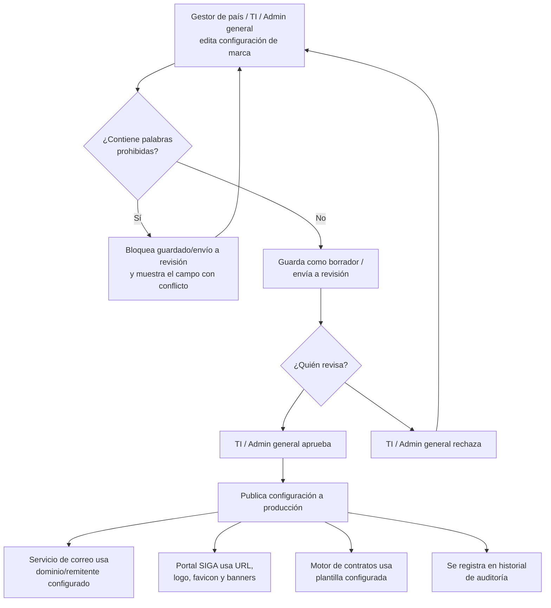

# PRD - Configuración de identidad de marca por proyecto en SIGA

| **Campo** | **Detalle** |
| --- | --- |
| **Proyecto** | Configuración de identidad de marca por proyecto en SIGA |
| **Área / empresa** | Garantiplus México |
| **Versión** | v0.1 |
| **Fecha** | 2026-08-31 |
| **Autores** | Daniela Carbajal |
| **Revisión / liderazgo** | Alexis Herrera |
| **Tipo de proyecto** | Feature web o API |

## 1. Resumen ejecutivo

SIGA es el sistema que Garantiplus México opera para administrar contratos de garantía extendida en varios países (México, Chile, Colombia). Hoy, la identidad de marca de cada país —dominio de correo, liga de acceso, logos, banners y plantillas de contrato— está fija en el sistema (`garantiplus.mx`, `garantiplus.cl`, `garantiplus.co`), sin ningún mecanismo para cambiarla sin intervención de desarrollo.

Esta situación se vuelve crítica con el lanzamiento de un nuevo proyecto en Argentina: la marca "Garantiplus" no puede utilizarse ahí por un conflicto legal previo (esa denominación perteneció a otra empresa en Argentina y generó problemas legales), por lo que se decidió operar ese mercado bajo el nombre "Engine Warranties". El sistema actual no tiene forma de dar de alta este proyecto sin arrastrar el nombre "Garantiplus" en correos, la liga de acceso, logos, banners o contratos.

El MVP construirá, desde el día uno, una **configuración de identidad de marca genérica y reutilizable por proyecto** dentro de SIGA (no una solución puntual solo para Argentina), que permita a TI, al Admin general y al Gestor de país definir el dominio y remitente de correo, la URL de acceso, el logo principal, favicon, banners y la plantilla de contrato de cualquier proyecto, con un flujo de borrador → aprobación → publicación y un validador automático que bloquea el uso de palabras prohibidas (como "Garantiplus" en el caso de Argentina).

El resultado esperado es eliminar el riesgo legal de recurrencia de marca en Argentina y, al mismo tiempo, dejar a SIGA preparado para que cualquier proyecto futuro configure su propia identidad sin depender de un despliegue de código.

**Configurar identidad de marca** → **Validación automática de palabras prohibidas** → **Aprobación por TI/Admin general** → **Publicación (correo, portal, contratos)**

## 2. Contexto y problema

Actualmente SIGA opera con tres identidades de marca completamente hardcodeadas en el sistema: `garantiplus.mx` (México), `garantiplus.cl` (Chile) y `garantiplus.co` (Colombia). No existe ningún proyecto con una configuración distinta a estas tres, y no hay mecanismo para agregar una nueva identidad sin modificar código.

El dolor concreto surge porque Garantiplus México decidió lanzar un proyecto para Argentina, pero ahí la marca "Garantiplus" no puede aparecer en ningún punto de contacto con el cliente (correos automáticos, liga de acceso, banners, logos, contratos): esa denominación perteneció a otra empresa en Argentina y su uso previo generó problemas legales. La empresa decidió operar este mercado como "Engine Warranties", pero SIGA, tal como está construido, no permite representar esa identidad sin tocar el sistema base.

No hay una fecha límite contractual para resolver esto, pero es urgente por el riesgo legal de reincidir en el conflicto de marca si el proyecto Argentina llega a producción con cualquier residuo de "Garantiplus".

Distinción clave para el equipo de desarrollo: en el modelo de SIGA, **un "proyecto" (país/operación) corresponde siempre a una sola "marca"/identidad** (relación 1 a 1) — no se contempla que un mismo proyecto deba mostrar más de una marca simultánea.

## 3. Objetivo del producto

Permitir que TI, el Admin general y el Gestor de país configuren la identidad de marca de cualquier proyecto en SIGA —dominio y remitente de correo, liga de acceso, logo, favicon, banners y plantilla de contrato— sin depender de cambios de código ni despliegue, eliminando el hardcodeo actual. Esto resuelve de forma inmediata el caso de Argentina/Engine Warranties y deja a SIGA preparado para que cualquier proyecto futuro defina su propia identidad de la misma manera.

Este proyecto no se plantea por fases: la configuración se construye de forma genérica desde el inicio, validando el flujo completo con el caso Argentina/Engine Warranties como primer proyecto real en usarla.

## 4. Usuarios y actores

| **Usuario / Actor** | **Rol en el proceso** |
| --- | --- |
| TI | Puede crear/editar la configuración de marca de un proyecto y es responsable de aprobar y publicar los cambios a producción. También valida manualmente la infraestructura de dominio de correo (SPF/DKIM/DNS) fuera de SIGA. |
| Admin general | Puede crear/editar la configuración de marca de un proyecto y, junto con TI, es responsable de aprobar y publicar los cambios a producción. |
| Gestor de país | Puede crear/editar la configuración de marca de su proyecto y enviarla a revisión, pero no puede aprobarla ni publicarla directamente. |
| Clientes finales / asegurados | Reciben correos, acceden a la liga y ven logos/banners/contratos con la marca configurada para su proyecto (p. ej. Engine Warranties en Argentina). |
| Distribuidores / talleres / ejecutivos de venta | Operan dentro de SIGA y ven la identidad de marca del proyecto en su uso diario del sistema. |
| Área legal / compliance | No usa el sistema directamente, pero valida que no aparezca "Garantiplus" (ni otras palabras prohibidas) en ningún punto de contacto del proyecto Argentina, y mantiene la lista de términos prohibidos. |

## 5. Alcance MVP y funcionalidades

| **Funcionalidad** | **Descripción** |
| --- | --- |
| Alta de identidad de marca por proyecto | Permite crear un registro de configuración con marca comercial, dominio/remitente de correo, URL de acceso y referencias a los archivos de marca, asociado a un proyecto de SIGA. |
| Configuración de dominio y remitente de correo | Define el dominio (p. ej. `enginewarranties.com.ar`) y el nombre del remitente que usará el servicio de envío de correos automáticos de SIGA para ese proyecto. Solo se pueden seleccionar dominios que TI haya validado manualmente (SPF/DKIM/DNS) fuera de SIGA. |
| Configuración de liga de acceso | Define la URL/subdominio de acceso al sistema para ese proyecto. La provisión de certificado SSL/DNS para una URL nueva es responsabilidad de TI/infraestructura, fuera de esta configuración. |
| Carga de logo, favicon y banners | Permite subir el logo principal (header, correos, documentos), el favicon, el banner de login/pantalla de acceso y el o los banners de dashboard/inicio, todos por proyecto. |
| Carga de plantilla de contrato | Permite subir y administrar la plantilla de contrato completa (marca, logo, razón social, textos) que usará ese proyecto al generar documentos. |
| Validación automática de palabras prohibidas | Antes de permitir guardar o enviar a revisión cualquier campo de texto o plantilla, el sistema valida que no contenga palabras de una lista de términos prohibidos (p. ej. "Garantiplus" para el proyecto Argentina) y bloquea la acción si encuentra alguna. |
| Flujo de borrador → aprobación → publicación | Los cambios de un Gestor de país quedan en borrador/enviados a revisión; solo TI o el Admin general pueden aprobarlos y publicarlos a producción. Ningún cambio llega a producción sin esta aprobación. |
| Historial de auditoría | Registra, para cada cambio, quién lo editó, qué campo modificó, el valor anterior y nuevo, quién lo aprobó y cuándo se publicó. |
| Aplicación de la configuración publicada | Al publicarse una configuración, el dominio/remitente se usa en el envío de correos, la URL/logo/favicon/banners en el portal web, y la plantilla en la generación de contratos del proyecto correspondiente. |

Principio rector del MVP: **ningún cambio de identidad de marca llega a producción sin pasar por aprobación de TI/Admin general y sin superar la validación automática de palabras prohibidas.** El sistema prioriza evitar por completo que una marca prohibida se publique, incluso a costa de fricción adicional en el flujo de edición.

## 6. Fuera de alcance

- **Migración/renombrado automático de proyectos ya existentes (Chile, Colombia, México)**: seguirán operando hardcodeados como hoy; migrarlos a la configuración genérica es una decisión y trabajo posterior, fuera de este MVP.
- **Multi-marca dentro de un mismo proyecto**: el modelo asume una relación 1 proyecto = 1 marca; no se soporta que un proyecto muestre más de una identidad simultánea.
- **Personalización de textos legales/idioma por proyecto**: el MVP sustituye marca, logo y datos de encabezado en la plantilla de contrato, pero no incluye traducir o reescribir el contenido legal base por proyecto.
- **Auto-servicio del Gestor de país sin aprobación de TI**: aunque puede crear/editar, el Gestor de país no puede publicar cambios por sí mismo; esto se mantiene así hasta que se valide el proceso con casos reales.

## 7. Flujos principales

El flujo parte de que cualquiera de los tres roles con permiso de edición (Gestor de país, TI, Admin general) puede modificar la configuración de marca de un proyecto. Antes de que el cambio pueda siquiera guardarse o enviarse a revisión, el validador automático revisa todos los campos de texto y la plantilla de contrato contra una lista de palabras prohibidas (mantenida por área legal); si encuentra una coincidencia, bloquea la acción de inmediato — este control es el que evita, a nivel de sistema, que "Garantiplus" vuelva a aparecer en Argentina.

Una vez que el cambio pasa la validación y es aprobado por TI o el Admin general, se publica y se refleja simultáneamente en los tres puntos de aplicación: el servicio de envío de correos, el portal web del proyecto y el motor de generación de contratos, además de quedar registrado en el historial de auditoría con el detalle de quién hizo y aprobó cada cambio.

## 8. Requerimientos funcionales

| **ID** | **Requerimiento** | **Descripción** |
| --- | --- | --- |
| RF-01 | Alta de configuración de marca por proyecto | El sistema permite crear un registro de identidad de marca (marca comercial, dominio/remitente, URL de acceso, referencias a archivos) asociado a un proyecto de SIGA. |
| RF-02 | Configuración de dominio y remitente de correo | El sistema permite definir el dominio y el nombre de remitente que usará el servicio de correo de SIGA para los envíos automáticos de ese proyecto, restringido a dominios previamente validados por TI. |
| RF-03 | Configuración de liga de acceso | El sistema permite asociar una URL/subdominio de acceso al proyecto, sin requerir cambios de código. |
| RF-04 | Carga de logo, favicon y banners | El sistema permite subir y actualizar el logo principal, favicon, banner de login y banner(s) de dashboard por proyecto. |
| RF-05 | Carga de plantilla de contrato | El sistema permite subir y administrar la plantilla de contrato completa por proyecto. |
| RF-06 | Validación automática de palabras prohibidas | El sistema valida todos los campos de texto y la plantilla de contrato contra una lista de palabras prohibidas y bloquea el guardado/envío a revisión si encuentra alguna coincidencia. |
| RF-07 | Flujo de aprobación | Los cambios quedan en estado borrador/en revisión hasta que TI o el Admin general los aprueban; solo entonces pueden publicarse. |
| RF-08 | Publicación aplicada a los canales | Al publicarse una configuración, el sistema actualiza de forma consistente el servicio de correo, el portal web y el motor de generación de contratos del proyecto correspondiente. |
| RF-09 | Historial de auditoría | El sistema registra usuario, fecha/hora, campo modificado, valor anterior y nuevo, y aprobador de cada cambio de configuración de marca. |
| RF-10 | Control de roles | El sistema restringe la creación/edición a TI, Admin general y Gestor de país, y restringe la aprobación/publicación exclusivamente a TI y Admin general. |

## 9. Requerimientos no funcionales

| **ID** | **Requerimiento** | **Descripción** |
| --- | --- | --- |
| RNF-01 | Verificación externa de dominio de correo | El sistema solo permite seleccionar/activar dominios de correo que TI haya validado manualmente (SPF/DKIM/DNS) fuera de SIGA; no realiza esta verificación de forma automática. |
| RNF-02 | Infraestructura de URL fuera de esta configuración | La provisión de certificado SSL y DNS para una nueva URL/subdominio es responsabilidad de TI/infraestructura; esta configuración únicamente administra qué URL se muestra/usa una vez provisionada. |
| RNF-03 | Trazabilidad y auditoría | Debe existir un historial inmutable de cada cambio (quién editó, qué campo, valor anterior/nuevo, quién aprobó y cuándo se publicó), dado el riesgo legal asociado a errores de marca. |
| RNF-04 | Seguridad y control de permisos | Separación estricta entre roles que pueden editar (Gestor de país, TI, Admin general) y roles que pueden aprobar/publicar (solo TI, Admin general); ningún otro rol tiene acceso de escritura. |
| RNF-05 | Validación determinística de contenido | El bloqueo por palabras prohibidas debe aplicarse de forma consistente a todos los campos de texto y a la plantilla de contrato, usando una lista mantenida por área legal. |
| RNF-06 | Escalabilidad a nuevos proyectos | El modelo de datos y la configuración deben soportar agregar identidades de marca para nuevos proyectos sin requerir cambios de código ni despliegue. |
| RNF-07 | Consistencia entre canales | Al publicarse un cambio, debe reflejarse de forma consistente en correo, portal web y generación de documentos, sin discrepancias entre lo que ve el cliente en cada canal. |

## 10. Integraciones y datos

| **Integración / Fuente** | **Uso esperado** |
| --- | --- |
| Servicio de envío de correos de SIGA | Lectura del dominio y remitente configurado del proyecto para el envío de correos automáticos. |
| Frontend/portal de SIGA por proyecto | Lectura de la URL de acceso, logo, favicon y banners configurados para renderizar el portal del proyecto. |
| Motor de generación de contratos/documentos | Lectura de la plantilla de contrato configurada al generar documentos del proyecto. |
| Almacenamiento de archivos (S3 u otro) | Almacenamiento y lectura de logos, favicon, banners y plantilla de contrato por proyecto. |

Datos mínimos requeridos por configuración de proyecto:
- Identificador de proyecto y marca comercial (ej. proyecto = Argentina, marca = "Engine Warranties").
- Dominio y remitente de correo, y URL de acceso al sistema.
- Referencias a archivos: logo principal, favicon, banner de login, banner(s) de dashboard, plantilla de contrato.
- Estado y metadatos de aprobación: estado (borrador / en revisión / publicado), usuario que editó, usuario que aprobó, fecha de publicación.

Esquema de permisos: el Gestor de país puede **crear y editar** la configuración de su proyecto y enviarla a revisión, pero no puede aprobarla ni publicarla. TI y el Admin general pueden crear, editar, **aprobar y publicar** cualquier configuración. Ningún cambio se aplica a producción (correo, portal, contratos) sin pasar por la aprobación de TI o Admin general y sin superar la validación automática de palabras prohibidas.

## 11. Eventos para BI

Eventos de configuración de marca:
- `configuracion_marca_creada`: se registra cuando se crea un nuevo registro de identidad de marca para un proyecto.
- `configuracion_marca_enviada_a_revision`: se registra cuando un Gestor de país envía cambios a revisión.
- `configuracion_marca_aprobada`: se registra cuando TI/Admin general aprueba un cambio.
- `configuracion_marca_rechazada`: se registra cuando TI/Admin general rechaza un cambio.
- `configuracion_marca_publicada`: se registra cuando una configuración aprobada se publica a producción.

Eventos de validación:
- `validacion_palabra_prohibida_bloqueada`: se registra cuando el validador automático bloquea un guardado/envío a revisión por detectar una palabra prohibida.

Campos mínimos por evento: fecha/hora, usuario que ejecuta la acción, identificador de proyecto, campo o elemento afectado, resultado (aprobado/rechazado/bloqueado), y motivo cuando aplique (ej. palabra prohibida detectada, razón de rechazo).

## 12. Métricas de éxito

| **Métrica** | **Descripción** |
| --- | --- |
| Referencias a "Garantiplus" en Argentina/Engine Warranties | Debe ser cero en correos, liga de acceso, banners, logos y contratos del proyecto Argentina, validado por área legal. |
| Tiempo de alta de un nuevo proyecto con marca propia | Tiempo que toma a TI configurar y publicar la identidad de un proyecto nuevo sin intervención de desarrollo; línea base y meta pendientes de validar con BI/operación. |
| Número de proyectos usando la configuración genérica | Cantidad de proyectos, además de Argentina, que adoptan esta configuración de marca en los meses posteriores al lanzamiento. |
| Cambios bloqueados por el validador de palabras prohibidas | Número de veces que el validador evitó que una palabra prohibida llegara a producción; mide la efectividad del control. |

## 13. Riesgos y supuestos

### Riesgos

| **Riesgo** | **Impacto potencial** |
| --- | --- |
| Recurrencia legal si queda un residuo de "Garantiplus" (ej. en metadata de PDF, footer de correo, texto oculto en plantilla) | Nuevo conflicto legal en Argentina y daño reputacional para el proyecto Engine Warranties. |
| Dependencia de infraestructura externa a SIGA (DNS/SSL/verificación de correo) | Retraso en el lanzamiento de un proyecto si TI/infraestructura no provisiona el dominio o la URL a tiempo. |
| Uso incorrecto por el Gestor de país sin capacitación suficiente | Configuraciones incompletas o erróneas que generan retrabajo o retrasan la aprobación. |

### Supuestos

| **Supuesto** | **Descripción** |
| --- | --- |
| Área legal validará y mantendrá la lista de palabras prohibidas | Se asume que legal/compliance entregará la lista exacta de términos prohibidos por proyecto y la mantendrá actualizada conforme cambien las restricciones. |
| Los proyectos actuales (Chile, Colombia, México) seguirán hardcodeados sin problema | Se asume que no migrarlos a la configuración genérica en este MVP no representa un riesgo legal u operativo inmediato. |

## 14. Preguntas abiertas

| **Tema** | **Pregunta abierta** |
| --- | --- |
| Gobernanza de roles | ¿Cuál es la diferencia exacta de permisos entre "TI" y "Admin general"? ¿Son el mismo nivel de acceso o hay matices entre ellos? |
| Cumplimiento legal | ¿Cuál es la lista exacta de palabras/términos prohibidos a validar (más allá de "Garantiplus"), y quién la mantiene actualizada en el tiempo? |
| Diseño técnico | ¿Qué restricciones de formato, tamaño y dimensiones aplican al logo, favicon, banners y plantilla de contrato? |
| Roadmap | ¿Existe un plan y una fecha objetivo para migrar Chile, Colombia y México a la configuración genérica de marca? |
| Infraestructura de correo | ¿Cuál es el procedimiento exacto que seguirá TI para verificar SPF/DKIM/DNS de un dominio nuevo antes de habilitarlo como opción en SIGA? |
| Métricas | ¿Cuál es la línea base y la meta numérica para "tiempo de alta de un nuevo proyecto" y las demás métricas, a validar con BI/operación? |
