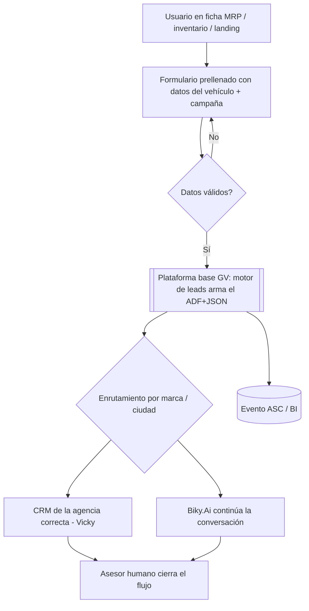
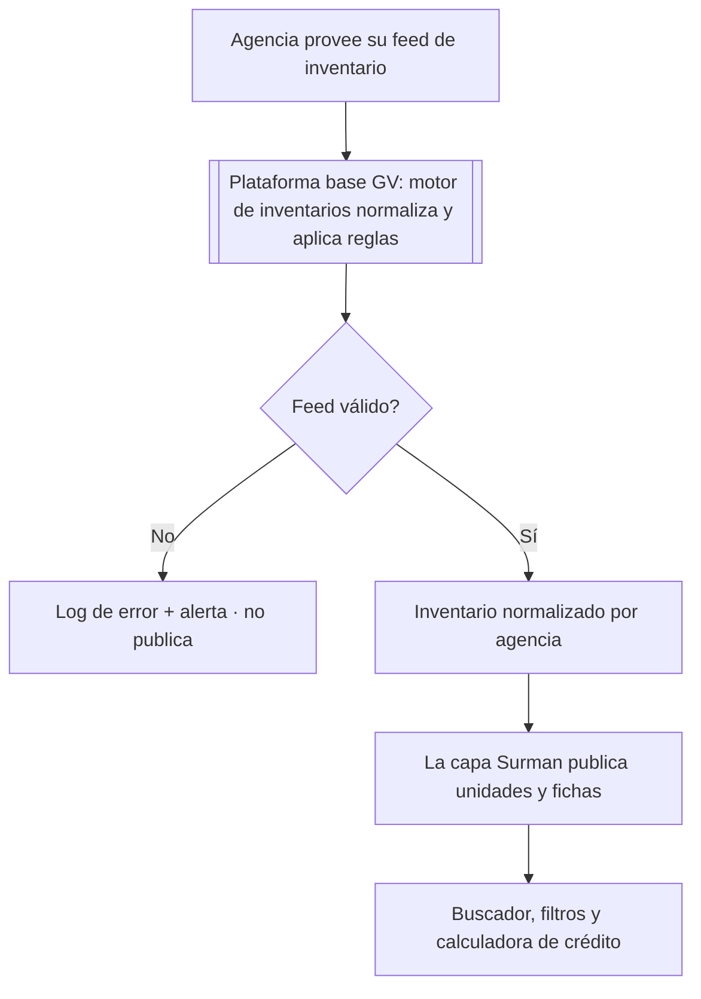
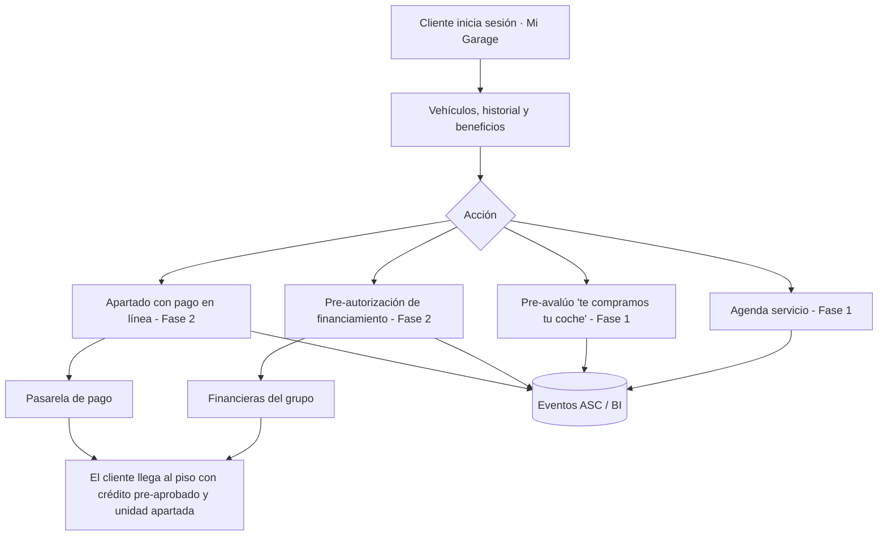

# PRD - Surman Drive · Plataforma digital Grupo Surman

| **Campo** | **Detalle** |
| --- | --- |
| **Proyecto** | Surman Drive — del sitio corporativo a la plataforma digital transaccional |
| **Área / empresa** | Go Virtual |
| **Versión** | v0.1 |
| **Fecha** | 2026-07-30 |
| **Autores** | Abigail Estrada (Go Virtual — Líder de sitios web) |
| **Revisión / liderazgo** | Aldo Álvarez — Director de TI, Go Virtual |
| **Tipo de proyecto** | Feature web / Plataforma |

## 1. Resumen ejecutivo

**Surman Drive** es la nueva plataforma digital de **Grupo Surman** (49 marcas —autos, motos y llantas— y ~160 agencias). El programa acompaña al cliente "del primer click a la recompra" sobre **una sola base tecnológica que crece por etapas**: lo que se construye en el MVP es la cimentación de las fases siguientes, sin reescrituras. La plataforma se apoya en **BRICK**, la tecnología de Go Virtual especializada en grupos automotrices, con más de 260 módulos en producción.

Grupo Surman impulsa la construcción de un **ecosistema digital conectado** (sitio, CRM, financiamiento y datos) que lo consolide como referente automotriz nacional. Su sitio corporativo actual es principalmente informativo y no está a la altura de esa evolución: se necesita una base más rápida, medible y visible —en buscadores y en motores de IA— capaz de crecer hacia la relación con el cliente y la transacción en línea.

El **MVP (La base)** entrega un sitio corporativo de las 49 marcas y ~160 agencias con catálogo, fichas de modelo dinámicas, inventario de nuevos y seminuevos, captación y enrutamiento de leads al CRM, integración con Biky.Ai, calculadora de crédito, medición bajo estándar ASC y SEO/AEO — **sin login, con el asesor humano cerrando cada flujo**. La **Fase 1 (La relación)** habilita el espacio del cliente (Login, Mi Garage, lealtad por niveles, agendamiento de servicio, pre-avalúo "te compramos tu coche"). La **Fase 2 (La transacción)** cierra el flujo en línea (pre-autorización de financiamiento, apartado con pago, e-commerce de refacciones, carga de documentación e inteligencia de cliente).

La arquitectura se organiza en **dos capas** (ver §3.2): una **capa Surman** —frontend, componentes a medida, contenido y datos del grupo— **co-desarrollable y transferible**, pensada para que Surman participe activamente y, a futuro, sea propietaria de ella; y una **plataforma base Go Virtual** —motores de inventario y leads, reglas de negocio e infraestructura— **operada como servicio y consumida mediante APIs**. Este diseño permite repartir tareas entre Surman y Go Virtual por fase y reducir la dependencia operativa del grupo.

Flujo resumido del MVP:
**El usuario explora catálogo/inventario** → **deja sus datos (lead con campaña)** → **enrutamiento al CRM de la agencia correcta + Biky.Ai** → **el asesor humano cierra**

## 2. Contexto y problema

**Punto de partida.** El sitio corporativo actual de Grupo Surman es principalmente informativo y no cubre lo que el grupo necesita para evolucionar como referente automotriz. El objetivo del proyecto es construir una base digital sólida que después crezca por etapas hacia la relación con el cliente y la transacción en línea. *(Este PRD no documenta el detalle operativo actual del grupo; las necesidades se confirmaron en sesiones de descubrimiento y los supuestos por validar se registran en §13 y §14.)*

**Necesidades a resolver.**
- **Catálogo y fichas siempre actualizados** de las 49 marcas (autos, motos y llantas), con precios, versiones y specs.
- **Leads con contexto y trazabilidad:** que cada prospecto llegue con modelo, ciudad y campaña de origen a la agencia correcta y al CRM del grupo.
- **Velocidad, SEO y visibilidad en IA:** un sitio rápido, con datos estructurados, citable por Google y por asistentes de IA.
- **Trazabilidad de la inversión de marketing** punta a punta, para decidir presupuesto con datos.

**Por qué ahora.** La visión del grupo es un ecosistema digital con sus procesos conectados que lo posicione de forma definitiva como el grupo automotriz número uno de México. El nuevo sitio corporativo es el eje de ese ecosistema y la base sobre la que se construyen las siguientes capacidades.

**Conceptos del dominio que conviene distinguir desde el inicio.**
- **Ficha de modelo (MRP)** —precio, versiones, specs— vs. **unidad de inventario** —stock físico de una agencia.
- **Inventario de nuevos** vs. **seminuevos** (este último alimentado, en Fase 1, por la retoma/pre-avalúo).
- **Lead** (prospecto enrutado, con datos de campaña) vs. **cliente autenticado** (Mi Garage, a partir de Fase 1).
- **Capa Surman** vs. **plataforma base Go Virtual** (ver §3.2).
- **MVP sin login / cierre humano** vs. **transaccional** (Fase 2): en el MVP el sistema no ejecuta transacciones ni autorizaciones sin intervención humana.

## 3. Objetivo del producto

Entregar a Grupo Surman una **plataforma web única, multi-sitio y multi-marca** que sirva las 49 marcas y ~160 agencias desde una sola infraestructura y **evolucione por etapas** del sitio corporativo (MVP) a la relación con el cliente (Fase 1) y a la transacción en línea (Fase 2). La plataforma debe mejorar de forma medible la captación y trazabilidad de leads, la velocidad y la visibilidad (SEO/AEO), e implementar el estándar de medición **ASC desde el primer día** para contar con una línea base del programa.

De forma transversal, la arquitectura se diseña en **dos capas** para que Surman participe activamente en el desarrollo y la operación de la capa que le pertenece y pueda, a futuro, ser propietaria de ella, reduciendo su dependencia operativa (ver §3.2).

### 3.1 Estrategia de implementación por fases

| **Fase** | **Nombre** | **Descripción** |
| --- | --- | --- |
| MVP | La base (mes 0–3) | Sitio corporativo de 49 marcas y ~160 agencias: catálogo, fichas de modelo dinámicas, inventario de nuevos/seminuevos, buscador, captación y enrutamiento de leads (con campaña) al CRM, integración Biky.Ai, calculadora de crédito, medición ASC y SEO/AEO. **Sin login; el asesor humano cierra cada flujo.** Alcance detallado en §5. |
| Fase 1 | La relación (mes 4–12) | El sitio deja de ser anónimo: Login y Mi Garage, lealtad por niveles, agendamiento de servicio, pre-avalúo "te compramos tu coche", seminuevos a profundidad, buscador por estilo de vida y gestión a escala de Google Business Profile con IA. |
| Fase 2 | La transacción (mes 12–24) | Cierre del flujo en línea: pre-autorización de financiamiento con las financieras del grupo, apartado de unidad con pago en línea, e-commerce de refacciones integrado, carga de documentación e inteligencia de cliente para la recompra. |

**Alcance de este PRD.** El documento detalla a fondo el **MVP** (alcance, flujos y requerimientos). **Fase 1 y Fase 2 se presentan como planteamiento inicial** —estrategia por fases y requerimientos etiquetados (§8–§9)— y **están sujetas a definición** en sesiones de trabajo posteriores; sus puntos por resolver se listan en §14. La evolución continua posterior a la Fase 2 (IA conversacional avanzada, campañas de equity, expansión AEO) forma parte del horizonte a 24 meses del programa pero queda fuera de este PRD. El arranque de cada fase se confirma con Surman con base en validaciones de alcance y prioridades.

### 3.2 Arquitectura de dos capas y modelo de propiedad (transversal)

La plataforma se organiza en dos capas con una frontera técnica explícita. Este diseño permite **repartir tareas entre Surman y Go Virtual** por fase y prepara la **transferencia futura de la capa Surman**. Cada requerimiento funcional (§8) se etiqueta con la capa a la que pertenece.

| **Capa** | **Qué incluye** | **Operación / acceso** | **Transferible a Surman** |
| --- | --- | --- | --- |
| **Capa Surman** | Frontend y experiencia de usuario a la identidad de Surman (Next.js / React / TypeScript / Tailwind); componentes a la medida del flujo de negocio por fase; contenido (fichas editoriales, blog, promociones, banners, landing pages); configuración de storefronts por agencia y de Google Business Profile; datos propios del grupo (leads en su CRM, cuentas de cliente, catálogo de seminuevos, refacciones). | Co-gestionable Surman + Go Virtual, con reparto de tareas por fase y accesos por rol con permisos granulares. Stack estándar de la industria. | **Sí**, por diseño: camino a que Surman opere y, a futuro, sea propietaria de esta capa. |
| **Plataforma base Go Virtual (BRICK)** | Motor de inventarios (ingesta, normalización, reglas de publicación); motor de leads (construcción y enrutamiento con datos de campaña); reglas de negocio del dominio automotriz; servicios/microservicios; base central de contenidos de marcas; CDP; infraestructura multi-tenant, BFF y seguridad. | **Operada como servicio por Go Virtual**; la capa Surman la consume a través de APIs y contratos estables. Su lógica interna se mantiene como servicio gestionado. | Se **opera como servicio y se consume vía API**; no forma parte de la capa entregable/transferible del proyecto. |

**Frontera técnica (contrato).** La capa Surman consume la plataforma base a través de contratos estables: inventario normalizado en JSON, leads en formato ADF+JSON y eventos de medición ASC. El límite es el **BFF (Backend-for-Frontend)**: del BFF hacia el usuario es capa Surman (transferible); del BFF hacia la plataforma es servicio gestionado por Go Virtual. Cualquier reparto de tareas o transferencia futura opera **sobre la capa Surman**.

> Nota: el modelo comercial (esquema de mantenimiento, precios y mecanismo contractual de transferencia de propiedad) queda fuera del alcance de este PRD funcional.

### 3.3 Ciclo de diseño y aprobación (transversal)

Surman Drive es un proyecto con experiencia **a medida**: cada fase incorpora un ciclo de diseño previo al desarrollo, con el **visto bueno del cliente como hito de aprobación (gate)** antes de construir.

**Diseño UX/UI (Figma)** → **Prototipado** → **Visto bueno del cliente** → **Desarrollo y estabilización**

- **Diseño UX/UI (Figma):** wireframes y diseño visual a la identidad de Surman para las pantallas y flujos de la fase.
- **Prototipado:** prototipo en Figma de **alcance acotado a los tiempos del proyecto** —principalmente scroll y algunos clics de las pantallas clave para validar la experiencia y los flujos principales—, **no necesariamente navegación completa**. El nivel de interactividad se ajusta a la ventana del MVP (3 meses).
- **Visto bueno del cliente (gate):** aprobación formal de Surman (marca/marketing y TI) sobre diseño y prototipo; es condición para pasar a desarrollo.
- **Desarrollo y estabilización:** construcción sobre el diseño aprobado, QA y estabilización posterior al go-live.

El diseño de la interfaz forma parte de la **capa Surman** (§3.2). Dado el objetivo de tener el **MVP listo en 3 meses**, el alcance del prototipo se prioriza para no frenar el desarrollo. El **detalle de fechas e iteraciones** de este ciclo se gestiona en el plan/Gantt, no en este PRD.

## 4. Usuarios y actores

| **Usuario / Actor** | **Rol en el proceso** |
| --- | --- |
| Comprador / prospecto (anónimo) | Usuario final del MVP: explora catálogo e inventario, cotiza y deja sus datos como lead. |
| Cliente autenticado (Mi Garage) | Desde Fase 1: gestiona sus vehículos, historial, beneficios, agendamiento y —en Fase 2— transacciones. |
| Asesor de ventas / piso (agencia) | Recibe el lead con contexto en el CRM y cierra el flujo comercial (humano). |
| Asesor de servicio / taller | Desde Fase 1: atiende el agendamiento de servicio y recordatorios. |
| Equipo de Marketing Surman | Gestiona contenido, promociones, banners y landing pages; consume medición de campañas; da visto bueno del diseño/prototipo (marca). |
| Equipo de Diseño Go Virtual | Diseña la experiencia UX/UI y el prototipo en Figma de cada fase, a la identidad de Surman. |
| Equipo de TI Surman | Configura y co-desarrolla la capa Surman; interlocutor técnico de la arquitectura de dos capas. |
| Equipo de Data Surman ("Data World") | Define y consume el pipeline de datos y la medición ASC; sincroniza la data mínima por etapa. |
| Comercio electrónico Surman | Responsable del e-commerce de refacciones a integrar en Fase 2. |
| PO Técnico / Implant (Go Virtual) | Recurso dedicado: orquesta el programa, publica, coordina y ejecuta parte técnica; punto único de coordinación. |
| Equipo Go Virtual (desarrollo, QA, analítica) | Construye y opera la plataforma base y la capa Surman; QA y mejora continua. |
| Biky.Ai / CRM del grupo ("Vicky") | Sistema: recibe leads y continúa la conversación; integración bidireccional. |
| Agencias / distribuidoras | Proveen los feeds de inventario. |
| Financieras del grupo | Desde Fase 2: pre-autorización de financiamiento. |
| Pasarela de pago | Desde Fase 2: cobro de apartados. |

## 5. Alcance MVP y funcionalidades

| **Funcionalidad** | **Descripción** |
| --- | --- |
| Sitio corporativo multi-marca | 49 marcas (autos, motos y llantas) sobre una sola infraestructura multi-sitio. |
| Red de ~160 agencias | Localizador con contacto por WhatsApp propio por agencia, formulario y llamada. |
| Fichas de modelo (MRP) dinámicas | Precio, versiones y specs por modelo, generadas desde la base central y siempre actualizadas. |
| Catálogo de inventario nuevos y seminuevos | Unidades reales por agencia/ciudad, publicadas automáticamente desde el feed. |
| Buscador con filtros + páginas por marca/ciudad | Navegación y descubrimiento con páginas dinámicas por marca y plaza. |
| Captación y enrutamiento de leads | Formulario prellenado desde la ficha/inventario; el lead viaja con datos de prospecto, vehículo y campaña, y se enruta al CRM de la agencia correcta. |
| Integración con Biky.Ai | IA conversacional + CDP + CRM del grupo: la conversación continúa con el contexto del prospecto. |
| Calculadora de crédito | Alimentada por el inventario; entrega una mensualidad orientativa (sin autorización) antes de hablar con un asesor. |
| Medición ASC sobre GA4 | Pipeline de datos y eventos bajo estándar Automotive Standards Council desde el día uno. |
| SEO técnico, AEO y datos estructurados | URLs semánticas y schema.org para indexación en Google y citación por motores de IA. |
| Contenido gestionable | Blog, promociones, banners y landing pages de campaña por plaza, editables. |
| Publicación automática de inventario | Feeds por agencia normalizados y publicados sin trabajo manual. |

**Principio rector del MVP.** El MVP prioriza una **base sólida, medible y visible** para las 49 marcas y ~160 agencias desde el día uno. **No toma decisiones transaccionales ni de autorización sin intervención humana**: no hay login ni cuentas de cliente, y **el asesor humano cierra cada flujo**. La medición ASC se implementa desde el inicio para que la línea base del programa exista desde el primer día.

## 6. Fuera de alcance

- **Reconstrucción de la plataforma base de Go Virtual:** se opera como servicio y se consume vía API; no forma parte de la capa entregable del proyecto (ver §3.2).
- **Login, cuentas de cliente y Mi Garage:** fuera del MVP; se habilitan en Fase 1 (el MVP opera anónimo con cierre humano).
- **Transacciones en línea (pre-autorización, apartados con pago, financiamiento):** fuera de MVP y Fase 1; se habilitan en Fase 2, sujetas a integración con financieras y pasarela.
- **E-commerce de refacciones:** fuera de MVP/Fase 1; en Fase 2 se integra el que ya construyó Surman (no se reconstruye).
- **Programa de lealtad por niveles:** fuera del MVP; se habilita en Fase 1.
- **Construcción del CRM del grupo (Vicky):** es sistema de Surman; la plataforma solo se **integra** con él.
- **Gestión de pauta / plataforma de publicidad digital:** vive en una herramienta distinta del grupo; fuera del alcance del sitio.
- **IA conversacional avanzada, lealtad avanzada, campañas de equity y expansión AEO:** corresponden a la evolución continua posterior a la Fase 2; fuera de este PRD.

## 7. Flujos principales

### 7.1 Captación y enrutamiento de leads (MVP)

El corazón del MVP es que **ningún lead se pierda ni llegue sin contexto**: el formulario se prellena con los datos del vehículo que el usuario ya vio (no se le pide recapturarlos), la plataforma base arma el lead con la capa de campaña y lo enruta a la agencia correcta entre ~160 ubicaciones. El cierre siempre es humano; Biky.Ai mantiene viva la conversación mientras tanto.

### 7.2 Publicación automática de inventario (MVP)

La publicación de inventario es **automática y sin trabajo manual**: las unidades de cada agencia entran por feed, la plataforma base las normaliza y aplica reglas, y la capa Surman las expone. Ante un feed inválido el sistema **no publica datos corruptos**: registra el error y alerta.

### 7.3 Del interés a la transacción — cliente autenticado (Fase 1 → Fase 2) · indicativo

> Flujo preliminar; el detalle de Fase 1 y Fase 2 está sujeto a definición (ver §3.1 y §14).

En Fase 1 el sitio empieza a conocer al cliente; en Fase 2 cierra el flujo en línea. El pre-avalúo de Fase 1 alimenta el ciclo **retoma → inventario de seminuevos → venta**, y en Fase 2 el comprador llega al piso con crédito pre-autorizado y unidad apartada. Las transacciones financieras pasan por las financieras del grupo y la pasarela de pago; la plataforma orquesta, no sustituye la autorización.

## 8. Requerimientos funcionales

Los RF del **MVP** constituyen el alcance firme de este PRD. Los RF de **Fase 1 y Fase 2** son un **planteamiento inicial sujeto a definición** (ver §14). La columna *Capa* indica a qué capa de la arquitectura (§3.2) pertenece cada requerimiento.

| **ID** | **Requerimiento** | **Descripción** | **Capa · fase** |
| --- | --- | --- | --- |
| RF-01 | Catálogo multi-marca | Publicar y navegar 49 marcas (autos, motos, llantas) con fichas MRP dinámicas (precio, versiones, specs). | Surman · MVP |
| RF-02 | Inventario nuevos/seminuevos | Mostrar unidades por agencia/ciudad con buscador y filtros. | Surman · MVP |
| RF-03 | Localizador de agencias | ~160 agencias con contacto por WhatsApp por agencia, formulario y llamada. | Surman · MVP |
| RF-04 | Captura de leads prellenada | Formularios que heredan datos del vehículo visto, sin recapturar. | Surman · MVP |
| RF-05 | Construcción y enrutamiento de leads | Generar el lead (ADF+JSON con prospecto + vehículo + campaña) y enrutarlo al CRM de la agencia correcta. | Plataforma base GV · MVP |
| RF-06 | Continuidad conversacional | Entregar el lead con contexto a Biky.Ai para continuar la conversación. | Co-desarrollo · MVP |
| RF-07 | Calculadora de crédito | Mensualidad orientativa alimentada por inventario, sin autorización. | Co-desarrollo · MVP |
| RF-08 | Medición ASC | Registrar eventos bajo estándar ASC sobre GA4 desde el día uno. | Co-desarrollo · MVP |
| RF-09 | SEO/AEO técnico | Datos estructurados schema.org y URLs semánticas para Google y motores de IA. | Surman · MVP |
| RF-10 | Contenido gestionable | Administrar blog, promociones, banners y landing pages por plaza. | Surman · MVP |
| RF-11 | Publicación de inventario | Ingerir feeds por agencia, normalizar y publicar sin trabajo manual. | Plataforma base GV · MVP |
| RF-12 | Login y Mi Garage | Registro/inicio de sesión y portal con vehículos, historial, beneficios y documentos. | Surman · Fase 1 |
| RF-13 | Agendamiento de servicio | Agendar taller de la marca más cercano, con datos prellenados, confirmación y recordatorios. | Co-desarrollo · Fase 1 |
| RF-14 | Lealtad por niveles | Acumulación de puntos y recompensas configurables por marca. | Co-desarrollo · Fase 1 |
| RF-15 | Ofertas personalizadas | Promociones según ubicación/CP, historial y auto del cliente. | Co-desarrollo · Fase 1 |
| RF-16 | Pre-avalúo "te compramos tu coche" | Pre-avalúo en línea (con disclaimer) + agenda de cita de valuación. | Co-desarrollo · Fase 1 |
| RF-17 | Seminuevos a profundidad | Catálogo enriquecido con valuación integrada (retoma → inventario → venta). | Surman · Fase 1 |
| RF-18 | Buscador por estilo de vida | Búsqueda por tipo de uso y comparador de hasta 3 modelos entre marcas. | Surman · Fase 1 |
| RF-19 | GBP a escala con IA | Gestión de ~150 fichas de Google Business Profile con respuestas asistidas por IA. | Co-desarrollo · Fase 1 |
| RF-20 | Pre-autorización de financiamiento | Solicitud en línea con las financieras del grupo y seguimiento desde Mi Garage. | Co-desarrollo · Fase 2 |
| RF-21 | Apartado con pago en línea | Reserva de unidad vía pasarela, con políticas de vigencia/devolución de Surman. | Co-desarrollo · Fase 2 |
| RF-22 | E-commerce de refacciones | Integrar la tienda de partes existente de Surman con el mismo look & feel. | Surman · Fase 2 |
| RF-23 | Carga de documentación | Upload seguro de documentos del cliente, reutilizable en operaciones futuras. | Surman · Fase 2 |
| RF-24 | Inteligencia de cliente | Vínculos familiares, equity y ciclos de recompra para campañas proactivas. | Plataforma base GV · Fase 2 |
| RF-25 | Analítica avanzada de ROI | Atribución punta a punta sobre el estándar ASC. | Co-desarrollo · Fase 2 |
| RF-26 | Control de accesos por rol | Permisos granulares que delimitan qué opera/configura cada equipo sobre la capa Surman. | Plataforma base GV · Transversal |

## 9. Requerimientos no funcionales

| **ID** | **Requerimiento** | **Descripción** |
| --- | --- | --- |
| RNF-01 | Disponibilidad | SLA de 99.9% sobre infraestructura cloud (AWS) con monitoreo activo. |
| RNF-02 | Performance | First Contentful Paint ~0.8s y buenos Core Web Vitals; caché ISR con revalidación (~2 min). |
| RNF-03 | Escalabilidad | Picos de campaña sin multiplicar el costo de cómputo (CDN global + ISR + arquitectura desacoplada). |
| RNF-04 | Seguridad | HTTPS/TLS end-to-end, JWT entre servicios, protección DDoS y BFF (el navegador nunca habla directo con la plataforma). |
| RNF-05 | Aislamiento multi-tenant | Los datos de Surman están aislados de los de otros clientes de la plataforma. |
| RNF-06 | Trazabilidad / auditabilidad | Logs y versionado de cambios en endpoints críticos. |
| RNF-07 | Permisos / IAM | Accesos por rol que delimitan la operación y configuración de cada capa (ver §3.2). |
| RNF-08 | Privacidad | Datos personales del cliente (Fase 1) y documentación sensible (Fase 2) con control de acceso; cumplimiento LFPDPPP. |
| RNF-09 | Mantenibilidad / portabilidad | La capa Surman usa stack estándar (Next.js/React/TypeScript/Tailwind), lo que permite el co-desarrollo por Surman y la transferencia futura de esa capa. |
| RNF-10 | Observabilidad | Monitoreo de feeds e integraciones con alertas ante fallos. |
| RNF-11 | SEO / AEO | schema.org y datos estructurados listos para Google y motores de IA (ChatGPT, Perplexity, Claude). |
| RNF-12 | Multi-sitio / multi-marca | Una sola infraestructura sirve 49 marcas y ~160 storefronts con propagación centralizada de cambios. |
| RNF-13 | Consistencia de datos | Inventario y contenido actualizados vía feed/API con refresco near-real-time (ISR); sin datos desactualizados persistentes. |
| RNF-14 | Manejo de errores | Reintentos y registro ante fallos de feeds/integraciones; el sistema no publica datos corruptos. |
| RNF-15 | Experiencia de usuario (UX/UI premium) | Experiencia a la identidad de Surman, validada por prototipo y aprobada por el cliente antes del desarrollo (ver §3.3). |

## 10. Integraciones y datos

| **Integración / Fuente** | **Uso esperado** |
| --- | --- |
| Biky.Ai / CRM del grupo ("Vicky") | Bidireccional (ADF+JSON): escritura de leads con contexto y continuidad conversacional. MVP. |
| Feeds de inventario de agencias | Lectura de unidades; normalización por la plataforma base. MVP. |
| Base central de contenidos de marcas (GV) | Lectura para generar fichas MRP y páginas dinámicas. MVP. |
| GA4 + medición ASC | Escritura de eventos estandarizados para BI. MVP. |
| Google Business Profile (~150 fichas) | Gestión y sincronización de fichas con el sitio (a escala en Fase 1). |
| Financieras del grupo | Pre-autorización de financiamiento (Fase 2). |
| Pasarela de pago | Cobro de apartados (Fase 2). |
| E-commerce de refacciones de Surman | Integración del storefront existente (Fase 2). |
| AWS (Go Virtual) | Hosting, almacenamiento de feeds e infraestructura de la plataforma. |

**Datos mínimos para operar.** Marca; modelo/versión/specs; precio; agencia/ubicación/CP; unidad de inventario (identificador de stock); lead (datos del prospecto + vehículo de interés + campaña). A partir de Fase 1: cuenta de cliente (vehículos, historial, beneficios). A partir de Fase 2: documentación del cliente y datos de transacción.

**Esquema de permisos.** La capa Surman **lee** contenido, inventario normalizado y métricas; **escribe/crea** contenido editorial, configuración de storefronts, cuentas de cliente y datos propios del grupo. Queda **bloqueado sin validación humana**: cualquier cierre comercial (MVP), autorización de financiamiento y cobro (Fase 2). La **plataforma base de Go Virtual** se consume mediante contratos de API y se opera como servicio gestionado.

## 11. Eventos para BI

Medición bajo estándar **Automotive Standards Council (ASC) sobre GA4**, implementada desde el MVP para tener línea base desde el día uno.

**Eventos ASC del sitio:**
- `asc_pageview`: se registra al cargar cualquier página relevante.
- `asc_menu_interaction`: interacción con navegación/menús.
- `asc_special_offer`: visualización/interacción con una promoción u oferta.
- `asc_element_configuration`: configuración de un elemento (p. ej. versión/color/filtro).
- `asc_media_interaction`: interacción con medios (galería, video, recorrido).
- `asc_retail_process`: avance en un proceso de compra/retail.
- `asc_cta_interaction`: click en un llamado a la acción.
- `asc_form_engagement`: interacción/envío de formulario.

**Eventos de negocio (por fase):**
- `lead_generado` / `lead_enrutado`: al crear el lead y al enrutarlo a la agencia correcta (MVP).
- `calculadora_credito_usada`: al obtener una mensualidad orientativa (MVP).
- `cuenta_creada` / `servicio_agendado` / `preavaluo_solicitado`: Fase 1.
- `financiamiento_preautorizado` / `apartado_pagado` / `documento_cargado`: Fase 2.

**Campos mínimos por evento:** fecha/hora, identificador de usuario/sesión, marca y modelo (si aplica), agencia/ciudad, campaña (si aplica), tipo de resultado y motivo (cuando aplique).

## 12. Métricas de éxito

| **Métrica** | **Descripción** |
| --- | --- |
| Leads generados y enrutados correctamente | Volumen de leads y % que llega a la agencia correcta con contexto completo (modelo, ciudad, campaña). Línea base a definir con BI/Data World. |
| Costo por lead calificado | CPL por modelo y plaza, para reasignar presupuesto de pauta. Meta a definir con marketing/BI. |
| Core Web Vitals / FCP | Cumplimiento de performance (objetivo FCP ~0.8s) en móvil. |
| Visibilidad SEO/AEO | Indexación en Google y citación en motores de IA; posiciones por marca/ciudad. Línea base a definir. |
| % de inventario publicado automáticamente | Proporción de unidades publicadas vía feed sin intervención manual. |
| Conversión a venta atribuida | Del primer click a la venta, sobre el estándar ASC. Requiere sincronía con el pipeline de Surman. |
| (Fase 1) Registros en Mi Garage y citas de servicio | Adopción del portal autenticado y del agendamiento. |
| (Fase 2) Apartados y pre-autorizaciones | Transacciones en línea completadas. |

Las líneas base y metas numéricas quedan **pendientes de validación con BI/operación (Data World Surman)**; no se fijan cifras en este PRD.

## 13. Riesgos y supuestos

### Riesgos

| **Riesgo** | **Impacto potencial** |
| --- | --- |
| Calidad y heterogeneidad de los feeds de inventario de ~160 agencias | Retrasos o datos incompletos en la publicación automática; necesidad de normalización adicional. |
| Dependencia de la integración con Vicky/Biky.Ai | Un contrato de datos inestable degrada el enrutamiento de leads y la continuidad conversacional. |
| Delimitación de la arquitectura de dos capas | Una frontera imprecisa entre la capa Surman y la plataforma base puede generar retrabajo o fricción en el co-desarrollo. |
| Disponibilidad del pipeline de datos de Surman (Data World) | La medición ASC y la atribución dependen de la data mínima que Surman provea por etapa. |
| Alcance de Fase 2 sujeto a terceros | Financieras y pasarela de pago condicionan tiempos y capacidades de la transacción en línea. |
| Cruce con el roadmap interno de proyectos del grupo | Prioridades del grupo que tocan el sitio corporativo pueden reordenar el plan por fases. |
| Continuidad del recurso dedicado (PO/implant) | La orquestación y el ritmo del programa dependen de un rol clave. |
| Iteraciones de diseño y visto bueno del cliente | Ciclos de revisión prolongados o aprobaciones tardías del diseño pueden mover el arranque del desarrollo de cada fase. |

### Supuestos

| **Supuesto** | **Descripción** |
| --- | --- |
| La plataforma base ya existe y está probada | Los motores de inventario y leads, las reglas de negocio y la infraestructura operan hoy en producción. |
| Surman provee insumos | Feeds de inventario por agencia, accesos a Biky.Ai/CRM, catálogo de marcas y validaciones de diseño en los hitos. |
| Medición ASC desde el MVP | El estándar ASC se implementa desde el día uno como línea base del programa. |
| Base tecnológica única heredada por fases | Lo construido en el MVP es la cimentación de Fase 1 y Fase 2, sin reescrituras. |
| Stack estándar habilita co-desarrollo | La capa Surman en Next.js/React/TypeScript permite repartir tareas y una transferencia futura de esa capa. |
| Disponibilidad para aprobación de diseño | Surman revisa y da visto bueno del diseño/prototipo en los tiempos acordados para no bloquear el desarrollo. |

## 14. Preguntas abiertas

| **Tema** | **Pregunta abierta** |
| --- | --- |
| Situación actual del grupo | Validar el detalle del ecosistema y los procesos actuales (captación de leads, gestión de inventario, sistemas en uso) para afinar contexto y supuestos. |
| Alcance de Fase 1 y Fase 2 | Fase 1 y Fase 2 son un planteamiento inicial: definir alcance fino, prioridades y dependencias de cada módulo antes de comprometer tiempos. |
| Alcance e iteraciones de diseño | Definir el alcance de diseño por fase (pantallas/flujos), el número de iteraciones incluidas y los responsables de aprobación (marca, marketing, TI). |
| Arquitectura de dos capas | Definir el inventario fino de componentes de la capa Surman y los contratos de API que marcan el límite del BFF por fase. |
| Reparto Surman ↔ GV | ¿Qué tareas y roles asume cada equipo por fase (publicación, configuración, desarrollo de componentes)? A definir en sesiones de trabajo. |
| Modelo de fases | Se adoptó el modelo Surman Drive (lealtad en Fase 1). Confirmar el contenido fino del módulo de lealtad y su ubicación definitiva. |
| Data mínima por etapa | ¿Cuál es la data mínima indispensable que se sincroniza con el pipeline de Data World en cada fase? |
| CRM | ¿Vicky es el único CRM de destino? ¿Alcance exacto de la bidireccionalidad? |
| Fase 2 — terceros | ¿Qué financieras y qué pasarela de pago específicas se integran? ¿Sus tiempos y requisitos? |
| Políticas de apartado | ¿Vigencia y política de devolución del apartado que definirá Surman? |
| Roadmap del grupo | ¿Cuál es el roadmap interno de proyectos de Surman que toca el sitio corporativo, para cruzarlo con el plan por fases? |
| Propiedad (funcional) | ¿Qué mecanismo y momento (funcional) se prevé para la transferencia de la capa Surman? (El detalle contractual/comercial queda fuera de este PRD.) |
| Revisión / liderazgo | Confirmar a Aldo Álvarez como revisión técnica y a los autores/patrocinadores por Surman. |
