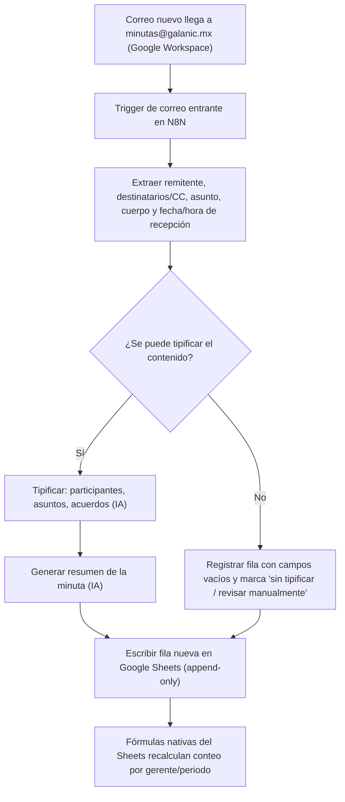

# PRD - Automatización de Minutas — Fuerza de Ventas Alfa

| **Campo** | **Detalle** |
| --- | --- |
| **Proyecto** | Automatización de Minutas — Fuerza de Ventas Alfa |
| **Área / empresa** | EngineCX |
| **Versión** | v0.1 |
| **Fecha** | 2026-07-09 |
| **Autores** | Omar André Lara Saldaña |
| **Revisión / liderazgo** | Aldo Álvarez (Director de TI) — patrocina: Gustavo Ivan Carreto Abascal |
| **Tipo de proyecto** | Automatización (interna, N8N) |

## 1. Resumen ejecutivo

Este proyecto construye un flujo de automatización en N8N que lee el correo `minutas@galanic.mx` (Google Workspace), donde la fuerza de ventas de Alfa debe reportar cada visita a punto de venta mediante una minuta con copia a ese buzón. El flujo tipifica automáticamente cada minuta recibida (remitente, destinatarios, participantes, asuntos y acuerdos), genera un resumen y registra todo en un Google Sheets centralizado.

Hoy el proceso de envío de minutas prácticamente no se ejecuta: no llega ninguna minuta al buzón, y no existe forma sistemática de saber quién cumple, quién no, y con qué oportunidad. Gustavo Ivan Carreto Abascal (patrocinador) necesita reportar a dirección sobre este cumplimiento, y hoy no tiene esa visibilidad.

El MVP cubre la ingesta, tipificación, resumen y registro automático de minutas, más un conteo de minutas por gerente/periodo calculado con fórmulas nativas de Sheets. No cubre (todavía) el cálculo de cobertura real contra visitas planeadas, porque esa fuente de datos no existe hoy — ver sección 6 y 14. El resultado esperado es dar a Israel, sus gerentes y Gustavo visibilidad automática y confiable de la actividad de minutas, como base para exigir y elevar el cumplimiento de un proceso que hoy es prácticamente inexistente.

**Correo entrante a `minutas@galanic.mx`** → **Tipificación y resumen (IA)** → **Registro en Google Sheets** → **Conteo por gerente/periodo (fórmulas nativas)**

## 2. Contexto y problema

- **Proceso actual:** los gerentes KS y demás roles de la fuerza de ventas de Alfa deben enviar, tras cada visita a un punto de venta, una minuta por correo con copia a `minutas@galanic.mx`. Hoy ese envío es manual y depende enteramente de la disciplina individual de cada gerente.
- **El dolor concreto:** actualmente no llega ninguna minuta al buzón. No existe manera sistemática de medir quién cumple, quién no, ni si la minuta se envía el mismo día de la visita (como se espera) o con horas/días de desfase.
- **Por qué ahora:** a Gustavo le piden reportes de dirección sobre este tema y hoy no tiene con qué armarlos. La meta es tener el flujo operando antes de la próxima quincena, cuando previsiblemente se repita esa solicitud.
- **Distinción de dominio:** no se detectaron conceptos confusos en el transcript de referencia — "minuta" se entiende como el correo-resumen de una visita a punto de venta, sin otro tipo de reporte con el que pueda confundirse.

## 3. Objetivo del producto

Dar visibilidad automática y confiable de qué gerentes de la fuerza de ventas de Alfa están enviando sus minutas de visita a punto de venta (y con qué oportunidad), para que Israel y su equipo puedan dar seguimiento y elevar el cumplimiento de un proceso que hoy prácticamente no se ejecuta. El producto no reemplaza el proceso de envío de minutas por correo; automatiza su lectura, tipificación y consolidación en un reporte único.

## 4. Usuarios y actores

| **Usuario / Actor** | **Rol en el proceso** |
| --- | --- |
| Gerentes KS / fuerza de ventas de Alfa | Generan las minutas (envían el correo con copia a `minutas@galanic.mx`) tras cada visita a punto de venta |
| Israel (líder de fuerza de ventas de Alfa) | Consume el reporte/Sheets para dar seguimiento a su equipo |
| Gerentes de Israel | Consultan el Sheets para revisar el cumplimiento de su gente directa |
| Gustavo Ivan Carreto Abascal | Patrocina el proyecto; usa el reporte para dirección |
| Buzón `minutas@galanic.mx` (Google Workspace) | Fuente de datos; dispara el flujo de N8N al recibir un correo nuevo |
| Flujo N8N | Tipifica, resume y escribe cada minuta en el Google Sheets |
| Google Sheets | Repositorio/reporte final, consultado por los actores humanos de arriba |

## 5. Alcance MVP y funcionalidades

| **Funcionalidad** | **Descripción** |
| --- | --- |
| Trigger de correo entrante | El flujo de N8N se dispara automáticamente cada vez que llega un correo nuevo a `minutas@galanic.mx` (vía conector de Google Workspace), sin hacer polling al buzón |
| Tipificación de la minuta | Extrae del correo: remitente, destinatario(s)/CC, participantes, asunto(s) y acuerdos |
| Resumen automático | Genera un resumen breve del contenido de la minuta (vía IA) |
| Registro en Google Sheets | Escribe una fila nueva por minuta con los campos tipificados + resumen + fecha/hora de recepción del correo (append-only) |
| Manejo de correos no tipificables | Si un correo no puede tipificarse razonablemente, se registra igual con los campos no identificados vacíos y una marca "sin tipificar / revisar manualmente" |
| Conteo de minutas por gerente/periodo | El Sheets calcula, mediante fórmulas nativas, cuántas minutas se han recibido por gerente y por periodo (semanal/quincenal) |

**Principio rector del MVP:** el sistema mide y da visibilidad; no fuerza el cumplimiento ni sustituye el canal de envío actual (correo). Tampoco decide ni escala nada automáticamente — toda acción de seguimiento hacia los gerentes la ejecutan Israel y su equipo con base en el reporte.

## 6. Fuera de alcance

- **Cálculo de cobertura real (visitas vs. minutas):** no entra al MVP porque no existe una fuente de datos de visitas planeadas/realizadas. Se habilitaría si se define e integra esa fuente (CRM, calendario, plan de ruta).
- **Recordatorios/alertas automáticas a gerentes que no envían minuta:** el MVP es de medición y reporte, no de enforcement. El seguimiento a quien no cumple lo hacen Israel y sus gerentes manualmente con el Sheets. Se habilitaría en una fase posterior si se decide automatizar el recordatorio.
- **Nuevo canal/formulario para capturar minutas:** el MVP solo lee lo que ya llega por correo a `minutas@galanic.mx`; no se sustituye el proceso de envío actual. Se habilitaría solo si se decide migrar el canal de captura.
- **Extensión a otros buzones/fuerzas de venta distintas a Alfa:** el alcance es específicamente `minutas@galanic.mx` de Alfa. Se habilitaría tras validar el proceso en esta unidad.
- **API vía MCP para reutilizar APIs existentes** (mencionada de pasada por Gustavo): queda fuera del MVP por no tener una necesidad concreta definida todavía. Se habilitaría si surge un caso de uso específico que la requiera.

## 7. Flujos principales

El flujo entra siempre por el buzón de Google Workspace, nunca por consulta activa (polling): esto evita cargas innecesarias y refleja las minutas casi en cuanto llegan. La decisión clave es si el contenido del correo se puede tipificar de forma confiable; ante duda, el flujo prioriza no perder el correo (lo registra igual, marcado para revisión) sobre bloquear o descartar silenciosamente. La agregación (conteo por gerente/periodo) vive fuera del flujo de N8N, como fórmulas del propio Sheets sobre la tabla cruda que el flujo va llenando.

## 8. Requerimientos funcionales

| **ID** | **Requerimiento** | **Descripción** |
| --- | --- | --- |
| RF-01 | Trigger por correo entrante | El flujo se activa automáticamente cuando llega un correo nuevo a `minutas@galanic.mx`, sin polling |
| RF-02 | Extracción de metadatos | Extrae remitente, destinatario(s)/CC, asunto, cuerpo y fecha/hora de recepción del correo |
| RF-03 | Tipificación de la minuta | Identifica participantes, asunto(s) tratados y acuerdos a partir del cuerpo (vía IA) |
| RF-04 | Resumen automático | Genera un resumen breve de la minuta (vía IA) |
| RF-05 | Registro en Sheets | Escribe una fila por minuta con los campos tipificados, resumen y fecha/hora de recepción |
| RF-06 | Manejo de correos no tipificables | Si no se puede tipificar razonablemente, registra la fila con los campos vacíos y una marca "sin tipificar / revisar manualmente" |
| RF-07 | Conteo agregado | El Sheets permite calcular (vía fórmulas nativas) el conteo de minutas por gerente y por periodo |
| RF-08 | Soporte para desfase de tiempo | Se registra la fecha/hora de recepción de cada minuta como base para el futuro cálculo de desfase visita→envío (fórmula pendiente, sección 14) |

## 9. Requerimientos no funcionales

| **ID** | **Requerimiento** | **Descripción** |
| --- | --- | --- |
| RNF-01 | Autenticación dedicada | N8N debe conectarse a `minutas@galanic.mx` vía OAuth2/app password gestionada por TI, no con el usuario/contraseña personal compartido informalmente |
| RNF-02 | Latencia no crítica | No se requiere tiempo real; basta con que cada minuta quede reflejada en el Sheets el mismo día de su recepción |
| RNF-03 | Permisos de acceso | Israel, sus gerentes y finanzas (si se confirma) tienen solo lectura sobre el Sheets; la edición de estructura/fórmulas queda restringida a TI |
| RNF-04 | Trazabilidad | Cada fila conserva remitente y fecha/hora de recepción del correo original, para poder auditar manualmente si hace falta |
| RNF-05 | Manejo de errores sin pérdida de datos | Fallos de conexión o de tipificación no deben perder el correo; se registra igual (RF-06) o se deja evidencia para revisión manual |
| RNF-06 | Privacidad | El contenido de las minutas puede incluir información de clientes/concesionarios; el acceso al Sheets se limita a los actores definidos, no es público |
| RNF-07 | Observabilidad básica | El flujo de N8N debe dejar logs de ejecución (éxito/fallo por correo procesado) para que TI pueda diagnosticar problemas sin depender de reportes manuales |

## 10. Integraciones y datos

| **Integración / Fuente** | **Uso esperado** |
| --- | --- |
| Google Workspace (Gmail) — `minutas@galanic.mx` | Solo lectura; trigger de correo entrante vía autenticación OAuth2 dedicada |
| Servicio de IA/LLM | Tipificación (participantes, asuntos, acuerdos) y generación de resumen a partir del cuerpo del correo (proveedor pendiente de definir en diseño técnico) |
| Google Sheets | Solo escritura tipo "append" (una fila nueva por minuta); nunca modifica ni borra filas existentes |
| N8N | Motor de orquestación de todo el flujo (trigger, extracción, llamada a IA, escritura) |

**Datos mínimos por minuta:** remitente, destinatario(s)/CC, participantes, asunto(s), acuerdos, resumen, fecha/hora de recepción del correo, estado (tipificado / sin tipificar).

**Esquema de permisos:** el flujo solo lee el buzón (nunca marca, mueve ni borra correos) y solo escribe filas nuevas en el Sheets (nunca modifica ni borra filas existentes). Ninguna acción del flujo requiere validación humana antes de ejecutarse, porque no toma decisiones de negocio — solo registra información; el seguimiento y las decisiones de gestión quedan siempre del lado de Israel, sus gerentes y Gustavo.

## 11. Eventos para BI

- `minuta_procesada`: se registra cuando el flujo escribe exitosamente una fila en el Sheets. Campos mínimos: fecha/hora de recepción, remitente, estado (tipificada / sin_tipificar).
- `error_flujo_minutas`: se registra cuando falla la conexión al correo o la llamada al servicio de IA, sin llegar a procesar el correo. Campos mínimos: fecha/hora, tipo de error.

## 12. Métricas de éxito

| **Métrica** | **Descripción** |
| --- | --- |
| Adopción de envío | % de gerentes que envían al menos una minuta por periodo (semanal/quincenal). Línea base actual: ~0% (hoy no llega ninguna) |
| Volumen procesado | Número total de minutas procesadas por periodo |
| Calidad de tipificación | % de minutas marcadas como "sin tipificar" sobre el total procesado (línea base pendiente de validar tras las primeras semanas de operación) |
| Desfase de envío | Tiempo promedio entre la visita y el envío de la minuta (fórmula de cálculo, línea base y meta pendientes — ver sección 14) |
| Cumplimiento de latencia | % de minutas reflejadas en el Sheets el mismo día de su recepción (valida RNF-02) |

## 13. Riesgos y supuestos

### Riesgos

| **Riesgo** | **Impacto potencial** |
| --- | --- |
| Baja adopción persistente pese al flujo | Si Israel y sus gerentes no refuerzan operativamente el hábito de enviar minutas, el reporte seguirá mostrando cumplimiento bajo/nulo — el sistema mide, no obliga |
| Calidad de tipificación variable | Minutas con redacción libre y sin formato estándar pueden generar muchas filas "sin tipificar", restando confiabilidad al reporte |
| Ausencia de fuente de "visitas realizadas" | Sin ese dato, nunca se podrá calcular cobertura real (visitas vs. minutas), solo volumen de minutas — limita el valor del reporte de dirección |
| Fórmula de desfase de tiempo sin definir | Si no se resuelve pronto con Aldo, esa métrica queda bloqueada indefinidamente, retrasando el reporte completo |
| Retraso en habilitar autenticación dedicada | Si TI no genera a tiempo el OAuth2/app password, el proyecto podría arrancar con las credenciales compartidas informalmente (riesgo de seguridad) o retrasarse esperando la migración |

### Supuestos

| **Supuesto** | **Descripción** |
| --- | --- |
| Refuerzo operativo de Israel/gerentes | El sistema no puede forzar el envío de minutas; se asume que habrá seguimiento humano activo para elevar el cumplimiento |
| Buzón ya operativo | `minutas@galanic.mx` ya existe y está activo en Google Workspace; Gustavo ya cuenta con credenciales de acceso |
| Volumen manejable | Se espera un volumen de decenas de minutas por semana, no miles — no se diseña para alta escala |
| Idioma y formato consistente | Las minutas llegan en español, en texto libre similar al patrón mostrado en el transcript de referencia |

## 14. Preguntas abiertas

| **Tema** | **Pregunta abierta** |
| --- | --- |
| Métricas | ¿Cuál será el criterio/fórmula exacta para calcular el desfase de tiempo entre la visita y el envío de la minuta? (pendiente de plática con Aldo) |
| Cobertura real | ¿Existirá en el futuro una fuente de datos de visitas planeadas/realizadas (CRM, calendario, plan de ruta) que permita calcular cobertura real vs. solo volumen de minutas? |
| Visibilidad | ¿Se confirma el acceso de Finanzas al Sheets, o se mantiene solo para Israel/gerentes/Gustavo? |
| Operación | ¿Cuál será la periodicidad definitiva del reporte: semanal o quincenal? |
| Diseño técnico | ¿Qué proveedor de IA/LLM se usará para la tipificación y el resumen de minutas? |
| Alcance futuro | ¿Se justifica en algún momento construir la API vía MCP que mencionó Gustavo, reutilizando APIs ya existentes? |
| Gobierno | ¿Se confirma formalmente a Aldo Álvarez como revisor técnico del proyecto? |
