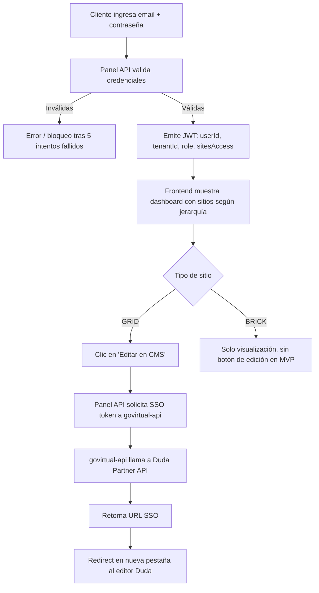
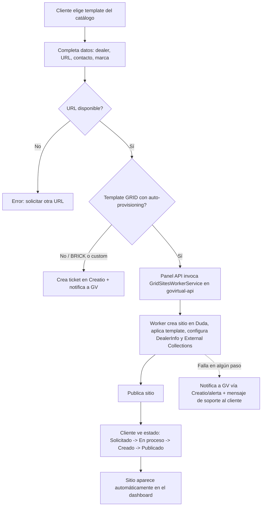

# PRD - Panel del Cliente — Go Virtual

| **Campo** | **Detalle** |
| --- | --- |
| **Proyecto** | Panel del Cliente — Go Virtual (app.govirtual.com.mx) |
| **Área / empresa** | Go Virtual |
| **Versión** | v1.0 |
| **Fecha** | Mayo 2026 |
| **Autores** | Abigail Estrada |
| **Revisión / liderazgo** | Alexis Herrera |
| **Tipo de proyecto** | Feature web o API |

## 1. Resumen ejecutivo

El Panel del Cliente es una plataforma web centralizada (app.govirtual.com.mx) que Go Virtual construye para los clientes de sus productos Brick (Next.js/Vercel) y Grid (Duda Whitelabel CMS) — grupos distribuidores y concesionarios que hoy no tienen visibilidad directa sobre sus sitios, leads, métricas ni datos, y deben canalizar cualquier cambio a través del equipo interno de Go Virtual.

Go Virtual opera más de 300 sitios web automotrices bajo estos dos productos. El problema actual: los clientes no saben cuántos sitios tienen activos, dependen del equipo de Soluciones para cualquier edición, no ven sus leads ni métricas en un solo lugar, y solicitan todo por canales informales (email, WhatsApp). Se estima que 30-40% de las solicitudes recurrentes al equipo de Soluciones corresponden a tareas que el cliente podría resolver de forma autónoma con este panel.

El MVP (Fase 1: Visibilidad y Acceso) cubrirá exclusivamente que el cliente pueda iniciar sesión, ver sus sitios activos según su rol y jerarquía (Grupo/Marca/Sitio), y acceder con un clic al editor de Duda (sitios GRID) y a sus add-ons contratados (Uberall, Cloud Campaign) vía SSO, sin credenciales adicionales. Los sitios BRICK, en esta fase, solo se visualizan (no cuentan con un CMS editable para el cliente). Las fases posteriores —Fase 2: Autogestión (edición de datos, tickets a Creatio, métricas, leads, banners) y Fase 3: Expansión (solicitud y auto-provisioning de nuevos sitios, mejoras de autenticación e integración de productos adicionales de la suite GV)— se detallan también en este documento para fines de cotización con el tercero desarrollador, aunque su construcción es incremental y posterior al MVP.

El resultado esperado es reducir la carga operativa del equipo de Soluciones, mejorar la experiencia y autonomía del cliente, y sentar las bases de un portal white-label replicable que se convierta, a mediano plazo, en el punto de entrada único a toda la suite Go Virtual.

**Login** → **Ver sitios según jerarquía (Grupo/Marca/Sitio)** → **Acceder vía SSO al editor Duda o add-ons** → **(Fase 2+) Autogestionar datos, tickets, métricas y banners**

## 2. Contexto y problema

La plataforma de Sitios Web de Go Virtual gestiona dos tipos de implementación: **GRID** (sitios basados en templates sobre Duda Whitelabel CMS, construcción escalable y rápida) y **BRICK** (sitios personalizados en Next.js/React desplegados en Vercel, mayor flexibilidad y control). Ambos comparten servicios de datos centralizados (inventarios, leads, DealerInfo) gestionados vía `govirtual-api` (NestJS + MongoDB Atlas en Render), y add-ons activos como Uberall (listados locales) y Cloud Campaign (redes sociales).

Hoy, cualquier cambio, consulta de leads o revisión de métricas del cliente pasa por el equipo interno de Go Virtual, coordinado por canales informales (email, WhatsApp).

**El dolor concreto:**
- No hay visibilidad de cuántos sitios están activos ni su estado.
- Editar el sitio requiere solicitarlo al equipo interno, generando fricción y dependencia.
- No hay acceso a leads propios sin pedir reportes manuales.
- No hay métricas web consolidadas en un solo lugar.
- Cada solicitud de soporte pasa por canales informales, sin trazabilidad.
- No se pueden gestionar banners/promociones propias sin pasar por GV.
- Solicitar un sitio nuevo es un proceso manual, lento y propenso a errores.

**Impacto operativo estimado:** 30-40% de las solicitudes recurrentes al equipo de Soluciones corresponden a tareas que el cliente podría autogestionar con este panel.

**Por qué ahora:** Go Virtual opera ya más de 300 sitios; el crecimiento de la base de clientes hace insostenible seguir canalizando toda gestión a través del equipo interno. El panel es la base para escalar sin incrementar proporcionalmente la carga del equipo de Soluciones.

**Distinción de dominio clave — GRID vs. BRICK:** determina qué puede autogestionar el cliente. Los sitios GRID tienen CMS (Duda) accesible vía SSO desde el MVP; los sitios BRICK no cuentan con un CMS accesible para el cliente hasta Fase 2, cuando ganan las mismas funcionalidades de autogestión (datos, leads, métricas, banners) que GRID. Esta distinción debe estar clara para el equipo de desarrollo desde el día uno, ya que cambia el comportamiento de la UI por tipo de sitio.

## 3. Objetivo del producto

Dar a los clientes de Brick & Grid (grupos distribuidores y concesionarios) autonomía para gestionar sus activos digitales —visibilidad de sitios, acceso a herramientas, edición de datos, leads, métricas y banners— sin depender del equipo interno de Go Virtual, reduciendo la carga operativa del equipo de Soluciones y mejorando la experiencia del cliente. A mediano plazo, el panel busca convertirse en el punto de entrada único a toda la suite de productos Go Virtual, sobre una base white-label replicable por marca.

### 3.1 Estrategia de implementación por fases

| **Fase** | **Nombre** | **Descripción** |
| --- | --- | --- |
| Fase 1 (MVP) | Visibilidad + Acceso | Ver sitios activos y acceder a herramientas (editor Duda, add-ons) vía SSO, sin credenciales adicionales. Menor complejidad relativa. |
| Fase 2 | Autogestión | Editar datos del dealer, abrir tickets a Creatio, ver métricas y leads, gestionar banners y promociones. Complejidad media. |
| Fase 3 | Expansión | Solicitar y autoprovisionar nuevos sitios, mejorar autenticación (Google OAuth, Magic Link) e integrar productos adicionales de la suite GV (Darwin AI, publicidad pagada, otros por definir). Mayor complejidad. |

El MVP de este PRD corresponde a la **Fase 1 (Visibilidad + Acceso)**. Las Fases 2 y 3 se detallan también en las secciones 5, 8 y 10 de este documento para fines de cotización con el tercero desarrollador, pero su construcción es posterior e incremental respecto al MVP.

## 4. Usuarios y actores

| **Usuario / Actor** | **Rol en el proceso** |
| --- | --- |
| Administrador de Grupo (Group Admin) | Responsable digital del grupo distribuidor completo (ej. Grupo Autocom). Visión consolidada de todos sus sitios y marcas, gestiona equipos de acceso y ve métricas agregadas. |
| Administrador de Marca (Brand Admin) | Responsable de una marca específica dentro del grupo (ej. Changan Autocom). Ve/edita los sitios de esa marca, ve leads y métricas de marca, abre tickets de soporte. |
| Editor de Sitio (Site Editor) | Usuario operativo que gestiona contenidos de uno o varios sitios específicos. Accede al editor Duda, gestiona contenido/ajustes del dealer, ve leads del sitio. |
| Viewer | Rol de solo lectura, asignado por cualquier admin superior sobre el alcance que se le defina; sin capacidad de edición. |
| Super Admin GV | Equipo interno de Go Virtual. Gestiona toda la plataforma, usuarios y configuraciones; activa o desactiva funcionalidades por cliente. |
| Equipo de Soluciones GV (indirecto) | Recibe y atiende, vía Creatio, los tickets que el cliente no logra resolver de forma autónoma en el portal. |

**Modelo de acceso y jerarquía multi-tenant.** El sistema utiliza una jerarquía de tres niveles que refleja la estructura real de los grupos distribuidores:

| **Nivel** | **Entidad** | **Ejemplo real** | **Alcance de acceso** |
| --- | --- | --- | --- |
| Nivel 1 | Grupo | Grupo Autocom | Todos los sitios del grupo (ej. 20 sitios de múltiples marcas) |
| Nivel 2 | Marca dentro del Grupo | Changan Autocom / Nissan Autocom | Solo los sitios de esa marca dentro del grupo (ej. 4 sitios Changan) |
| Nivel 3 | Sitio individual | Changan Autocom Querétaro | Solo ese sitio específico |

**Regla clave de acceso:** los permisos se heredan hacia abajo pero nunca hacia arriba. Un usuario asignado a nivel Marca solo ve los sitios de esa marca; un usuario de Grupo ve todo. El acceso se configura desde el panel de Admin GV (Super Admin GV → Group Admin → Brand Admin → Site Editor / Viewer).

## 5. Alcance MVP y funcionalidades

| **Funcionalidad** | **Descripción** |
| --- | --- |
| Autenticación propia | Login con email/contraseña, JWT (expiración configurable, default 8h) con claims userId/tenantId/role/sitesAccess, contraseñas con bcrypt (≥12 rounds), recuperación de contraseña vía email (token de un solo uso, 30 min), bloqueo de cuenta 15 min tras 5 intentos fallidos, y gestión de usuarios (alta/baja/activación, first-login flow) desde el panel interno GV. |
| Dashboard de sitios | Grid de sitios activos asignados al usuario según su rol/jerarquía, con filtro por marca, contador de sitios por marca (para usuarios de grupo), buscador por nombre/URL, y estado visual diferenciado (activo/inactivo/en construcción); los sitios cancelados dejan de mostrarse. |
| SSO al editor Duda (sitios GRID) | Botón "Editar en CMS" que genera un token SSO vía Duda Partner API y abre el editor de Duda en una nueva pestaña, únicamente para sitios dentro del scope de acceso del usuario autenticado. |
| Visualización de sitios BRICK | Los sitios BRICK se muestran solo en modo lectura (nombre, URL, estado, marca), sin botón de edición — no cuentan con CMS accesible para el cliente en el MVP. |
| SSO a add-ons (Uberall, Cloud Campaign) | Acceso con un clic, en nueva pestaña, a los add-ons contratados por el cliente y configurados por Super Admin GV, sin necesidad de credenciales adicionales; si un add-on no soporta SSO, se muestra el acceso directo con instrucciones. |
| Extensión del panel administrativo interno GV | Nueva sección dentro del panel Lovable existente para que el equipo GV cree organizaciones (grupos), gestione usuarios del portal (nombre, email, rol, organización/marca(s), sitios permitidos), active/desactive accesos y add-ons por cliente, y consulte el log de accesos del portal. |
| Visualización de leads (condicional) | Listado de los últimos 30 días de leads del cliente (fecha, prospecto, tipo de formulario, sitio de origen), filtrable por fecha y sitio, sin exportación ni detalle completo — condicional a que el proveedor confirme viabilidad en la fase de discovery; de no confirmarse, pasa a Fase 2 sin cambio en su especificación. |

**Principio rector del MVP:** el MVP prioriza deliberadamente la visibilidad y el acceso sin fricción por sobre la autogestión de datos. Ningún módulo del MVP permite editar información del dealer, crear tickets, ver métricas más allá de leads (condicional), ni gestionar banners — esas capacidades se difieren a Fase 2 para mantener el MVP acotado y lanzable rápido.

## 6. Fuera de alcance

| **Elemento fuera de alcance** | **Justificación** |
| --- | --- |
| Rediseño o modificación de govirtual-api | El panel consume govirtual-api tal como está; cambios a la API son responsabilidad del equipo interno de GV. |
| Nuevas integraciones de inventarios o feeds | Fuera del scope del panel del cliente en las 3 fases cotizadas. |
| Migración de datos históricos de leads a nueva estructura | Responsabilidad del equipo de datos de GV, no del panel. |
| Construcción de la UI del panel administrativo Lovable | El tercero entrega la especificación de endpoints de la Panel API; la UI dentro del panel Lovable existente es responsabilidad del equipo interno de GV, salvo que se acuerde lo contrario en el contrato de cotización. |
| Selección e implementación del CMS para tutoriales y documentación | GV debe definir la solución de gestión de contenido (headless CMS, Notion, Contentful o CRUD propio) antes de iniciar Fase 2; el portal solo consume el contenido vía API. |
| Configuración de propiedades GA4 / Search Console | Configuración de infraestructura de analytics a cargo de GV, no del tercero. |
| Configuración de workflows en Creatio | Responsabilidad del equipo de operaciones de GV con los administradores de Creatio. |
| Diseño de brand guidelines del portal | Go Virtual provee el design system y guía de marca al tercero; no se diseña desde cero. |
| Infraestructura de producción (dominios, SSL, DNS) | Gestionada por el equipo de GV. |
| Facturación y gestión de cuenta | Identificado como visión de largo plazo; no forma parte de las 3 fases cotizadas. Habilitaría una futura Fase 4. |
| Notificaciones in-app | Visión de largo plazo; no forma parte de las 3 fases cotizadas. |
| White Label del portal (branding por grupo distribuidor) | Visión de largo plazo; no forma parte de las 3 fases cotizadas, aunque el objetivo estratégico de construir una base replicable por marca sí orienta las decisiones de arquitectura del MVP. |
| Reportes automatizados programados (envío periódico por email) | Visión de largo plazo; no forma parte de las 3 fases cotizadas. |
| App móvil nativa (iOS/Android) | Visión de largo plazo; no forma parte de las 3 fases cotizadas. |
| Microsoft OAuth como método de autenticación | Prioridad baja frente a Google OAuth y Magic Link (Fase 3); se evaluará solo si hay demanda de grupos distribuidores con Microsoft 365. |
| Integración con Darwin AI, publicidad pagada y otros productos GV | Mini-fases independientes dentro de Fase 3+, fuera de las 3 fases base de esta cotización; se definirán caso por caso según adopción y disponibilidad de API. |

## 7. Flujos principales

**Flujo 1 — Login y SSO al editor Duda (MVP).** Cubre el flujo core del MVP: autenticación, filtrado de sitios por jerarquía, y la bifurcación de comportamiento GRID (SSO habilitado) vs. BRICK (solo visualización).

**Flujo 2 — Solicitud y auto-provisioning de nuevo sitio (Fase 3).** Ilustra la decisión clave entre sitios auto-provisionables (GRID con template) y los que requieren intervención manual (BRICK o template no automatizable), y el manejo de fallas del worker.

## 8. Requerimientos funcionales

> **Nota de normalización:** el documento original trae colisiones de numeración de RF entre módulos y fases (p. ej. RF-017, RF-035, RF-067 y RF-072 se repetían en más de una sección). Se renumeraron aquí de forma consecutiva y global (RF-01…RF-99); ver pregunta abierta correspondiente en la sección 14 para validar que esta renumeración no rompa referencias usadas en la cotización con el tercero.

| **ID** | **Fase** | **Requerimiento** | **Descripción** |
| --- | --- | --- | --- |
| RF-01 | MVP | Login con email/contraseña | El sistema debe permitir a los usuarios registrados iniciar sesión con email y contraseña. |
| RF-02 | MVP | Hashing de contraseñas | Las contraseñas deben almacenarse con hashing bcrypt (mínimo 12 rounds). |
| RF-03 | MVP | Emisión de JWT | Tras autenticación exitosa, el sistema debe emitir un JWT con tiempo de expiración configurable (default: 8 horas). |
| RF-04 | MVP | Claims del JWT | El JWT debe incluir en sus claims: userId, tenantId, role, sitesAccess (lista de site IDs permitidos). |
| RF-05 | MVP | Recuperación de contraseña | Flujo de recuperación vía email con token de un solo uso, expiración de 30 minutos. |
| RF-06 | MVP | Bloqueo por intentos fallidos | Tras 5 intentos fallidos consecutivos, la cuenta debe bloquearse temporalmente por 15 minutos. |
| RF-07 | MVP | Cierre de sesión | El sistema debe soportar cierre de sesión con invalidación del JWT activo. |
| RF-08 | MVP | Gestión de usuarios (Super Admin GV) | Los Super Admins de GV deben poder crear, activar, desactivar y eliminar usuarios desde el panel administrativo. |
| RF-09 | MVP | Onboarding de usuario nuevo | Al crear un usuario nuevo, el sistema debe enviar un email de bienvenida con link de configuración de contraseña (first-login flow). |
| RF-10 | MVP | Dashboard de sitios | El dashboard debe mostrar una lista/grid de sitios activos asignados al usuario autenticado. |
| RF-11 | MVP | Datos de tarjeta de sitio | Cada tarjeta de sitio debe mostrar: nombre del sitio, marca, URL pública, estado (activo/inactivo), thumbnail o favicon. |
| RF-12 | MVP | Filtro por marca | Si el usuario tiene acceso a múltiples marcas, debe poder filtrar por marca. |
| RF-13 | MVP | Contador de sitios por marca | Si el usuario tiene acceso a un grupo completo, debe poder filtrar por marca y ver un contador de sitios por marca. |
| RF-14 | MVP | Datos en tiempo real | La lista de sitios debe obtenerse en tiempo real desde govirtual-api usando los site IDs del JWT. |
| RF-15 | MVP | Estado visual de sitios | Sitios inactivos o en construcción deben mostrarse con estado visual diferenciado, pero no ocultarse. |
| RF-16 | MVP | Sitios cancelados | Los sitios cancelados deben dejar de mostrarse. |
| RF-17 | MVP | Buscador de sitios | Debe existir un buscador por nombre de sitio o URL dentro del dashboard del usuario. |
| RF-18 | MVP | Botón de edición (GRID) | Cada tarjeta de sitio GRID debe mostrar un botón "Editar en CMS" claramente visible. |
| RF-19 | MVP | Solicitud de SSO a Duda | Al hacer clic, el Panel API debe solicitar a govirtual-api la generación de un SSO token vía Duda Partner API para el site_name correspondiente. |
| RF-20 | MVP | Apertura del SSO | El frontend debe abrir el enlace SSO en una nueva pestaña. |
| RF-21 | MVP | Vigencia del token SSO | El SSO token debe tener tiempo de vida mínimo suficiente para completar la redirección. |
| RF-22 | MVP | Error en generación de SSO | Si la generación del token falla, el usuario debe recibir un mensaje de error con opción de reintentar. |
| RF-23 | MVP | Scope de SSO | El acceso SSO solo debe generarse para sitios incluidos en el JWT del usuario autenticado; ningún usuario puede solicitar SSO de un sitio al que no tiene acceso. |
| RF-24 | MVP | Sitios BRICK en MVP | Para sitios BRICK, la tarjeta debe mostrar solo información de visualización (nombre, URL, estado, marca), sin botón de edición; a partir de Fase 2 el cliente BRICK tendrá acceso a las funcionalidades correspondientes. |
| RF-25 | MVP | Sección de herramientas | El dashboard debe mostrar una sección de "Herramientas" con los add-ons activos del cliente. |
| RF-26 | MVP | Add-ons contratados | Solo deben mostrarse los add-ons contratados por el cliente (configurados por Super Admin GV). |
| RF-27 | MVP | SSO a Uberall | Para Uberall, el Panel API debe consumir su API para generar el enlace SSO correspondiente al tenant del cliente. |
| RF-28 | MVP | SSO a Cloud Campaign | Para Cloud Campaign, el Panel API debe consumir su API para generar el enlace SSO correspondiente. |
| RF-29 | MVP | Add-on sin SSO disponible | Si un add-on no tiene SSO disponible, debe mostrar la URL de acceso directo con credenciales precargadas (si la plataforma lo permite) o un link de acceso con instrucciones. |
| RF-30 | MVP | Apertura de add-ons | Los add-ons deben abrirse en una nueva pestaña. |
| RF-31 | MVP | Alta de organizaciones | El equipo de GV debe poder crear organizaciones (grupos) y asociarlas a los dealers existentes en govirtual-api, desde la nueva sección del panel interno. |
| RF-32 | MVP | Gestión de usuarios del portal | Crear y gestionar usuarios del portal del cliente: nombre, email, rol, organización/marca(s) asignadas, sitios permitidos. |
| RF-33 | MVP | Activación/desactivación de usuarios | Activar o desactivar el acceso de un usuario del portal sin eliminarlo. |
| RF-34 | MVP | Configuración de add-ons por cliente | Configurar qué add-ons están disponibles y activos por cliente/organización. |
| RF-35 | MVP | Log de accesos | Ver log de accesos del portal: último login de cada usuario cliente, intentos fallidos de autenticación. |
| RF-36 | MVP | Autenticación de la nueva sección interna | La nueva sección del panel Lovable debe consumir los endpoints de la Panel API mediante el mismo mecanismo de autenticación que ya usa el panel interno para govirtual-api (JWT interno de GV). |
| RF-37C | MVP (condicional) | Listado de leads (30 días) | El cliente debe poder ver un listado de los últimos 30 días de leads de sus sitios, con fecha, nombre del prospecto, tipo de formulario y sitio de origen. Condicional a confirmación de viabilidad del proveedor en discovery. |
| RF-38C | MVP (condicional) | Filtros de leads (MVP) | El listado debe ser filtrable al menos por rango de fechas y por sitio. Condicional (ver RF-37C). |
| RF-39C | MVP (condicional) | Fuente de datos de leads (MVP) | Los datos de leads se consumen desde govirtual-api filtrados por los dealers del usuario autenticado. Condicional (ver RF-37C). |
| RF-40C | MVP (condicional) | Sin exportación en MVP | No se incluye exportación a CSV ni detalle completo del lead en esta versión MVP; esas capacidades se completan en Fase 2. Condicional (ver RF-37C). |
| RF-41 | Fase 2 | Actualización de DealerInfo | Al guardar cambios, el Panel API debe actualizar el registro DealerInfo correspondiente en govirtual-api vía su API. |
| RF-42 | Fase 2 | Sincronización con Duda | La actualización en govirtual-api debe disparar el proceso de sincronización existente con Duda (Content Library update). |
| RF-43 | Fase 2 | Confirmación visual de guardado | El cliente debe ver confirmación visual de que el cambio fue guardado y propagado. |
| RF-44 | Fase 2 | Campos no editables | Si un campo no es editable para ese cliente (por restricciones de marca), debe mostrarse como solo lectura con una leyenda explicativa. |
| RF-45 | Fase 2 | Activación de edición por cliente | La activación/desactivación de la capacidad de edición por cliente debe ser configurable desde el panel de Super Admin GV. |
| RF-46 | Fase 2 | Log de cambios de DealerInfo | Debe mantenerse un log de cambios (quién cambió qué y cuándo) visible para Super Admins GV. |
| RF-47 | Fase 2 | Creación de ticket | El cliente debe poder crear un nuevo ticket seleccionando área destino, asunto, descripción detallada y nivel de urgencia (Normal/Alta). |
| RF-48 | Fase 2 | Adjuntos en tickets | El formulario debe permitir adjuntar archivos (imágenes, documentos) con un máximo de 10MB por adjunto. |
| RF-49 | Fase 2 | Creación de ticket en Creatio | Al enviar, el Panel API debe crear el ticket en Creatio vía su API REST, incluyendo datos del cliente, área destino, asunto, descripción y adjuntos. |
| RF-50 | Fase 2 | Asignación interna en Creatio | La lógica de asignación interna en Creatio debe ser manejada por los workflows de Creatio, no por el panel. |
| RF-51 | Fase 2 | Historial de tickets | El cliente debe poder ver el historial de sus tickets con número, asunto, fecha de creación, área y estado (Abierto/En progreso/Resuelto/Cerrado). |
| RF-52 | Fase 2 | Sincronización de estado de ticket | Al cambiar el estado del ticket en Creatio, el portal debe reflejar el estado actualizado (vía polling o webhook, a definir con el equipo de Creatio). |
| RF-53 | Fase 2 | Notificaciones de ticket | El cliente debe recibir una notificación por email al crear un ticket y al cambiar su estado. |
| RF-54 | Fase 2 | Rango de fechas de métricas | El cliente debe poder seleccionar el rango de fechas a analizar (últimos 7/30/90 días o rango personalizado). |
| RF-55 | Fase 2 | Métricas por sitio o consolidadas | Si el usuario tiene múltiples sitios, debe poder ver métricas por sitio individual o consolidadas a nivel grupo/marca. |
| RF-56 | Fase 2 | Visualizaciones de métricas | Las métricas deben mostrarse con visualizaciones (gráficas de línea para tendencias, barras para comparativos, tarjetas para KPIs principales). |
| RF-57 | Fase 2 | Conexión a GA4/Search Console | El Panel API debe conectarse a la GA4 API y Search Console API usando una Service Account configurada por Go Virtual, sin exponer credenciales al cliente. |
| RF-58 | Fase 2 | Sitio sin GA4 configurado | Si un sitio no tiene GA4 configurado, la sección de métricas debe mostrar un estado de "Sin datos disponibles" con instrucciones para configurarlo. |
| RF-59 | Fase 2 | Listado de leads (completo) | El cliente debe poder ver un listado de leads con fecha/hora, nombre del prospecto, tipo de formulario, sitio de origen y estado básico. |
| RF-60 | Fase 2 | Filtros de leads (completo) | El listado debe ser filtrable por rango de fechas, tipo de formulario y sitio de origen. |
| RF-61 | Fase 2 | Detalle de lead | El cliente puede ver el detalle de un lead individual con todos los campos capturados en el formulario. |
| RF-62 | Fase 2 | Exportación de leads | Debe existir la opción de exportar el listado de leads a CSV para el rango y filtros seleccionados. |
| RF-63 | Fase 2 | Fuente de datos de leads | Los datos de leads se consumen desde govirtual-api filtrados por los dealers del cliente autenticado. |
| RF-64 | Fase 2 | Restricción de datos sensibles de leads | La información sensible (datos de contacto completos del prospecto) solo debe ser visible para usuarios con rol Brand Admin o superior. |
| RF-65 | Fase 2 | Listado de banners | El cliente puede ver el listado de banners/promociones activos en cada uno de sus sitios. |
| RF-66 | Fase 2 | Creación de banner | Crear un nuevo banner: imagen (JPG/PNG/WebP, máximo 5MB), URL de destino, título/texto alternativo, fechas de vigencia (inicio y fin). |
| RF-67 | Fase 2 | Edición/eliminación de banners | Editar o eliminar banners existentes. |
| RF-68 | Fase 2 | Activación de banners | Activar o desactivar un banner individualmente sin eliminarlo. |
| RF-69 | Fase 2 | Validación de dimensiones | El sistema debe validar las dimensiones de la imagen según las especificaciones del sitio (a definir por el equipo técnico de GV por template). |
| RF-70 | Fase 2 | Propagación de banners | Los cambios en banners se guardan en govirtual-api y se propagan automáticamente al sitio vía el mecanismo existente de sincronización. |
| RF-71 | Fase 2 | Activación del módulo de banners | El Super Admin GV puede activar o desactivar este módulo por cliente/organización desde el panel administrativo. |
| RF-72 | Fase 2 | Módulo de banners bloqueado | Cuando el módulo está desactivado para un cliente, la sección debe mostrarse bloqueada con la leyenda: "La gestión de banners para esta cuenta está administrada por el equipo de Go Virtual". |
| RF-73 | Fase 2 | Acceso a tutoriales | La sección de tutoriales debe ser accesible desde el menú principal del portal para todos los roles. |
| RF-74 | Fase 2 | Categorías de tutoriales | Los tutoriales deben organizarse por categoría: Primeros pasos, Gestión de sitios, Edición en Duda, Leads y métricas, Banners y promociones, Gestión de usuarios, Tickets y soporte. |
| RF-75 | Fase 2 | Contenido de tutoriales | Cada tutorial debe poder contener texto formateado, imágenes, videos embebidos (YouTube/Loom) y pasos numerados. |
| RF-76 | Fase 2 | Búsqueda de tutoriales | El cliente debe poder buscar tutoriales por palabra clave. |
| RF-77 | Fase 2 | Gestión de tutoriales sin deploy | El Super Admin GV debe poder crear, editar y publicar/despublicar tutoriales desde el panel interno, sin necesidad de un deploy. |
| RF-78 | Fase 2 | Tutoriales destacados | Los tutoriales deben poder marcarse como "Destacados" para aparecer en la página de inicio de la biblioteca. |
| RF-79 | Fase 2 | Links contextuales a tutoriales | El sistema debe poder asociar tutoriales a secciones específicas del portal mediante links contextuales. |
| RF-80 | Fase 2 | Documentación de API | La sección de documentación de API debe mostrar los endpoints disponibles relevantes para clientes: formatos de leads, estructura de inventarios, webhooks disponibles, etc. |
| RF-81 | Fase 2 | Formato de referencia de API | La documentación debe presentarse en formato estructurado tipo referencia de API: endpoint, método HTTP, descripción, parámetros, ejemplo de request y response. |
| RF-82 | Fase 2 | Filtro de documentación por área | La documentación debe poder filtrarse por área (Leads, Inventarios, Sitios, Autenticación). |
| RF-83 | Fase 2 | Guías de integración | Debe incluir una sección de "Guías de integración" con ejemplos paso a paso para casos de uso comunes. |
| RF-84 | Fase 2 | Actualización de documentación sin deploy | La documentación debe poder actualizarse desde el panel interno de GV (o un repositorio de contenido definido) sin necesidad de un deploy del portal. |
| RF-85 | Fase 2 | Restricción de acceso a documentación de API | El acceso a la documentación de API debe restringirse a usuarios con rol Brand Admin o superior. |
| RF-86 | Fase 3 | Catálogo de templates | El cliente debe ver un catálogo de templates disponibles, organizado por marca/industria, con preview visual. |
| RF-87 | Fase 3 | Solicitud de nuevo sitio | El cliente selecciona un template y completa la información requerida: nombre del dealer, URL deseada, datos de contacto iniciales, información de la marca. |
| RF-88 | Fase 3 | Validación de URL | El sistema debe validar que la URL solicitada no esté en uso. |
| RF-89 | Fase 3 | Disparo de auto-provisioning | Si el template solicitado es un GRID template con auto-provisioning habilitado, el sistema dispara el flujo automatizado. |
| RF-90 | Fase 3 | Ticket para sitios no automatizables | Si el sitio requiere desarrollo personalizado (BRICK) o un template no automatizable, el sistema debe crear un ticket en Creatio y notificar al equipo de GV. |
| RF-91 | Fase 3 | Invocación del worker de creación | El Panel API debe invocar a govirtual-api para ejecutar el worker de creación de sitio Duda (GridSitesWorkerService ya existente). |
| RF-92 | Fase 3 | Pasos del worker | El worker debe crear el sitio en Duda, aplicar el template, configurar el DealerInfo, configurar las External Collections y publicar el sitio. |
| RF-93 | Fase 3 | Estado del proceso en tiempo real | El cliente debe ver el estado del proceso en tiempo real o vía polling: Solicitado → En proceso → Sitio creado → Publicado. |
| RF-94 | Fase 3 | Aparición automática en dashboard | Al completarse, el nuevo sitio debe aparecer automáticamente en el dashboard del cliente. |
| RF-95 | Fase 3 | Tiempo objetivo de entrega | El tiempo objetivo de entrega para sitios template es de 2 a 4 horas desde la solicitud confirmada. |
| RF-96 | Fase 3 | Manejo de fallas del worker | Si el proceso falla en algún paso, el sistema debe notificar al equipo de GV vía Creatio/alerta interna y al cliente con un mensaje de soporte. |
| RF-97 | Fase 3 | Login vía Google OAuth 2.0 | El sistema debe soportar login vía Google OAuth 2.0 como método prioritario, dado que los equipos de distribuidores en México usan predominantemente Google Workspace. |
| RF-98 | Fase 3 | Magic Link | El sistema debe soportar Magic Link (passwordless) como método alternativo sin contraseña, con prioridad media frente a Google OAuth. |
| RF-99 | Fase 3 | Evaluación de Microsoft OAuth | El sistema debe evaluar el soporte de Microsoft OAuth como método de autenticación adicional, según demanda de grupos distribuidores que usen Microsoft 365/Office 365. Prioridad baja. |

## 9. Requerimientos no funcionales

| **ID** | **Requerimiento** | **Descripción** |
| --- | --- | --- |
| RNF-01 | Tiempo de respuesta de login | El endpoint de login debe responder en menos de 500ms en condiciones normales. |
| RNF-02 | Comunicación segura | Toda comunicación del portal debe ser exclusivamente sobre HTTPS. |
| RNF-03 | Entrega de emails transaccionales | Los emails de recuperación de contraseña y de bienvenida deben enviarse en menos de 2 minutos. |
| RNF-04 | Performance del SSO a Duda | El flujo de SSO a Duda debe completarse end-to-end en menos de 3 segundos. |
| RNF-05 | Tasa de error en autenticación | La tasa de errores en login/SSO debe mantenerse por debajo de 1%. |
| RNF-06 | Control de acceso multi-tenant | Los permisos se heredan hacia abajo en la jerarquía Grupo→Marca→Sitio, nunca hacia arriba; el acceso SSO y a datos solo puede generarse para sitios incluidos en el scope (JWT) del usuario autenticado. |
| RNF-07 | No duplicación de lógica de negocio | La Panel API no debe duplicar la lógica de negocio ya existente en govirtual-api; para DealerInfo, sitios, leads e inventarios debe consumir sus endpoints como fuente de verdad. |
| RNF-08 | Autenticación sin dependencias externas (MVP) | El MVP debe usar JWT stateless + bcrypt, compatible con el sistema de auth actual de govirtual-api, sin depender de proveedores externos de identidad. |
| RNF-09 | Reutilización de infraestructura existente | El proyecto debe operar sobre la infraestructura ya contratada por GV (Render para backend, Vercel para frontend, cluster MongoDB Atlas existente, AWS S3), sin incorporar nuevos proveedores, para no incrementar costos ni complejidad operativa. |
| RNF-10 | Capacidad ante concurrencia | Las integraciones con APIs de terceros (particularmente Duda Partner API) deben soportar la concurrencia esperada de hasta 350 clientes activos sin degradar el rate limit disponible. |
| RNF-11 | Privacidad de datos sensibles | Los datos de contacto completos de los prospectos (leads) y la documentación técnica de la API solo deben ser visibles para roles Brand Admin o superior. |
| RNF-12 | Trazabilidad de cambios y accesos | Debe mantenerse un log de accesos al portal (últimos logins, intentos fallidos) y un log de cambios sobre DealerInfo (quién cambió qué y cuándo), visibles para Super Admins GV. |
| RNF-13 | Independencia de despliegue | Se recomienda que la Panel API inicie como servicio independiente (repositorio propio) para que el tercero pueda desarrollar en paralelo sin bloquear al equipo interno de govirtual-api. |

## 10. Integraciones y datos

| **Integración / Fuente** | **Uso esperado** |
| --- | --- |
| govirtual-api (NestJS existente) | Fuente de verdad para DealerInfo, sitios, leads e inventarios. Lectura para dashboard/métricas/leads; escritura para actualización de DealerInfo y banners (Fase 2); ejecución del worker de auto-provisioning (Fase 3). |
| Duda Partner API (@dudadev/partner-api) | Generación de tokens SSO para el editor de sitios GRID (MVP) y para el worker de creación de sitios (Fase 3). Ya integrado en govirtual-api. |
| Uberall API | Generación de enlace/token SSO para el add-on de gestión de listados locales (MVP). Requiere validar previamente con el proveedor sus capacidades de SSO programático. |
| Cloud Campaign API | Generación de enlace/token SSO para el add-on de gestión de redes sociales (MVP). Requiere validación previa con el proveedor. |
| Creatio API REST | Creación y seguimiento de tickets/solicitudes del cliente (Fase 2) y de tickets automáticos de auto-provisioning fallido o no automatizable (Fase 3). Requiere acceso, schema de ticket y configuración de workflows de asignación, coordinados con el equipo de Creatio. |
| Google Analytics 4 API | Métricas de tráfico web (sesiones, usuarios, páginas vistas, canales) vía Service Account de GV (Fase 2). |
| Google Search Console API | Métricas de SEO básico (impresiones, clics, CTR, posición) vía Service Account de GV (Fase 2). |
| AWS S3 (existente) | Almacenamiento de imágenes de banners y otros recursos del portal (Fase 2). |
| MongoDB Atlas (nueva colección, cluster existente) | Persistencia de usuarios del portal, sesiones, configuraciones de acceso y permisos por tenant. |
| Google OAuth 2.0 | Método de autenticación alternativo prioritario para reducir fricción en equipos B2B con Google Workspace (Fase 3). |
| Google Ads / Meta Ads API | Dashboard de resultados de publicidad pagada (impresiones, clics, conversiones, gasto). Integración futura de Fase 3+, complejidad alta, sin especificación detallada aún. |
| Darwin AI | Visualización de conversaciones y métricas del chat en sitios. Integración futura de Fase 3+, sin especificación detallada aún. |

**Datos mínimos a manejar:** userId, tenantId (grupo/marca/sitio) y jerarquía de acceso, role, sitesAccess (lista de site IDs permitidos); DealerInfo (teléfonos, dirección estructurada, emails de leads, WhatsApp, horarios de atención, URL de mapa, redes sociales); leads (fecha/hora, nombre del prospecto, tipo de formulario, sitio de origen, estado); banners (imagen, URL destino, título/alt text, fechas de vigencia, estado activo/inactivo); tickets (área destino, asunto, descripción, urgencia, adjuntos, estado, historial).

**Esquema de permisos:** Super Admin GV tiene acceso total (lectura/escritura sobre toda la plataforma, incluida la creación de organizaciones y usuarios). Group Admin lee/gestiona todo su grupo. Brand Admin lee/edita los sitios y datos de su marca. Site Editor gestiona contenido y DealerInfo solo de sus sitios asignados. Viewer solo lee, sin capacidad de edición en ningún nivel. Ningún rol cliente escribe directamente sobre govirtual-api: toda escritura pasa por la Panel API, que valida el scope del usuario antes de proxear la operación. Los campos no editables para un cliente (por restricciones de marca) se bloquean en modo solo lectura con leyenda explicativa, y esa restricción es configurable por Super Admin GV.

## 11. Eventos para BI

- `portal_login_exitoso`: se registra cuando un usuario autentica correctamente. Campos: fecha/hora, userId, tenantId, role.
- `portal_login_fallido`: se registra en cada intento de login fallido. Campos: fecha/hora, email/userId (si existe), motivo, intentos_consecutivos.
- `portal_password_recovery_solicitado`: se registra cuando un usuario solicita recuperación de contraseña. Campos: fecha/hora, userId/email.
- `sso_duda_generado`: se registra cuando se genera un token SSO al editor de Duda. Campos: fecha/hora, userId, site_id, resultado (éxito/error), tiempo de generación.
- `sso_addon_generado`: se registra cuando se genera un token/enlace SSO a un add-on (Uberall, Cloud Campaign). Campos: fecha/hora, userId, add-on, resultado.
- `ticket_creado`: se registra cuando el cliente crea un ticket hacia Creatio. Campos: fecha/hora, userId, tenantId, área destino, urgencia.
- `ticket_estado_actualizado`: se registra cuando cambia el estado de un ticket. Campos: fecha/hora, ticket_id, estado_anterior, estado_nuevo.
- `dealer_info_actualizado`: se registra cuando el cliente edita datos del dealer. Campos: fecha/hora, userId, dealer_id, campos_modificados.
- `banner_creado` / `banner_activado` / `banner_desactivado`: se registran en cada acción sobre banners. Campos: fecha/hora, userId, site_id, banner_id, acción.
- `lead_visualizado`: se registra cuando el cliente consulta el listado o detalle de un lead. Campos: fecha/hora, userId, dealer_id, filtros aplicados.
- `sitio_solicitado` / `sitio_autoprovisionado_completado` / `sitio_autoprovisionado_fallido` (Fase 3): se registran durante el flujo de auto-provisioning. Campos: fecha/hora, userId, template_id, site_id resultante (si aplica), resultado, motivo de falla (si aplica).

## 12. Métricas de éxito

| **Fase** | **Métrica / criterio de aceptación** | **Objetivo o forma de verificación** |
| --- | --- | --- |
| MVP | % de clientes activos con al menos 1 login en los primeros 30 días | > 60% |
| MVP | Tiempo de generación SSO Duda end-to-end | < 3 segundos (test de performance en producción) |
| MVP | Tasa de errores en login/SSO | < 1% (test de seguridad automatizado) |
| MVP | Un usuario ve solo los sitios a los que tiene acceso según su rol | QA con múltiples usuarios de distintos niveles de jerarquía |
| MVP | Un usuario GRID ve el botón "Editar en Duda"; un usuario BRICK ve la tarjeta en modo solo lectura sin botón | QA diferenciado por tipo de sitio |
| MVP | Un usuario no puede solicitar SSO de un sitio fuera de su scope de acceso | Prueba de seguridad: llamada directa a endpoint con site_id no asignado |
| MVP | Un Super Admin GV puede crear un usuario desde el panel interno Lovable y asignarlo a una marca específica | QA del flujo de onboarding de cliente |
| MVP | El sistema bloquea la cuenta tras 5 intentos fallidos | Test de seguridad automatizado |
| MVP | El email de recuperación de contraseña llega en menos de 2 minutos | QA de flujo de recovery |
| MVP (condicional) | Si leads está en MVP: el cliente ve sus leads de los últimos 30 días filtrados por sus dealers | QA con datos de producción de govirtual-api |
| Fase 2 | % de solicitudes de actualización de datos que llegan vía portal vs. canal informal | > 50% en 3 meses post-lanzamiento |
| Fase 2 | Reducción de tickets de bajo valor en Creatio de tipo "actualizar teléfono / email de leads" | > 70% de reducción |
| Fase 2 | NPS del portal (encuesta a clientes) | > 7/10 |
| Fase 2 | % de acciones realizadas por el cliente sin ticket al equipo interno | Encuesta / analítica de uso del portal vs. tickets en Creatio |
| Fase 3 | % de nuevos sitios template solicitados que se autoprovisionan sin intervención manual | > 80% |
| Fase 3 | Tiempo promedio de entrega de sitio template vía auto-provisioning | < 4 horas |
| Fase 3 | % de productos GV integrados al panel en 12 meses | Seguimiento trimestral con el equipo de producto |
| Transversal | Adaptabilidad del portal a nuevas marcas sin re-desarrollo | Validación técnica al incorporar una nueva marca/grupo distribuidor |

## 13. Riesgos y supuestos

### Riesgos

| **Riesgo** | **Impacto potencial** |
| --- | --- |
| La API de Uberall o Cloud Campaign no soporta SSO programático | Alto — funcionalidad de Fase 1 incompleta. Mitigación: validar capacidades de SSO con cada proveedor antes del inicio del desarrollo; plan B de link directo + credenciales compartidas. |
| Acceso a Creatio API no disponible o requiere configuración extensa | Alto — Fase 2 bloqueada. Mitigación: coordinar con el equipo de Creatio/ops antes de iniciar Fase 2; definir schema de ticket y workflows de asignación. |
| Las propiedades de GA4 no están bajo la cuenta de GV | Alto — métricas no disponibles. Mitigación: auditar acceso de GV a las propiedades GA4 de todos los sitios clientes; proceso de migración de administración si aplica. |
| Duda SSO Partner API con limitaciones de rate o permisos | Alto — afecta el core del MVP. Mitigación: validar límites de rate limit para 350 clientes concurrentes (govirtual-api ya usa @dudadev/partner-api). |
| Complejidad del modelo multi-tenant subestimada | Alto — arquitectura incorrecta desde el inicio. Mitigación: definir el modelo de datos de tenancy y permisos como primer entregable técnico, con revisión del equipo de GV antes de continuar. |
| Migración de 350 clientes al portal requiere proceso de onboarding | Medio — esfuerzo operativo no estimado, probabilidad alta. Mitigación: definir onboarding por fases (piloto de 20 clientes, luego rollout gradual). |
| Cambios en govirtual-api durante el desarrollo del panel rompen la integración | Medio. Mitigación: versionar los endpoints de govirtual-api que consume el panel; coordinación entre equipos. |
| La nueva sección del panel Lovable requiere alineación de contratos de API entre el tercero y el equipo interno de GV | Medio — puede generar bloqueos entre equipos. Mitigación: el tercero entrega la especificación de endpoints de la Panel API al inicio del proyecto; el equipo interno de GV compromete tiempo de desarrollo en paralelo. |
| Si la visualización de leads se incluye en el MVP y govirtual-api tiene latencia alta, impacta la experiencia del dashboard | Medio, probabilidad baja. Mitigación: implementar con paginación y carga lazy; definir SLA de respuesta con el equipo de govirtual-api. |

### Supuestos

| **Supuesto** | **Descripción** |
| --- | --- |
| Acceso administrador a GA4/Search Console | Se asume que GV tiene o puede obtener acceso de administrador a las propiedades GA4/Search Console de todos los sitios de sus clientes antes del inicio de Fase 2. |
| SSO programático de Uberall/Cloud Campaign | Se asume que ambos proveedores exponen algún mecanismo de SSO o autenticación programática; queda sujeto a validación (ver riesgos). |
| Disponibilidad de la API de Creatio | Se asume que el acceso a la API de Creatio estará disponible y no requerirá configuración extensa antes de iniciar Fase 2. |
| Capacidad de infraestructura existente | Se asume que Render, Vercel, el cluster de MongoDB Atlas y AWS S3 tienen capacidad para soportar la nueva carga sin necesidad de escalar contratos. |
| Disponibilidad del equipo interno GV para la sección Lovable | Se asume que el equipo interno de GV comprometerá tiempo de desarrollo en paralelo para construir la UI de la nueva sección dentro del panel Lovable. |
| Cobertura del modelo de tenancy | Se asume que el modelo de datos de tenancy (Grupo/Marca/Sitio) definido en este PRD cubre la totalidad de las estructuras organizacionales reales de los clientes de GV. |
| Migración gradual de clientes | Se asume una migración gradual de los ~350 clientes existentes al portal, iniciando con un piloto de 20 clientes antes del rollout completo. |

## 14. Preguntas abiertas

| **Tema** | **Pregunta abierta** |
| --- | --- |
| Numeración de requerimientos | Este documento renumeró de forma consecutiva y global los RF que en el PDF original colisionaban entre fases (RF-017, RF-035, RF-067, RF-072 se repetían). Validar que esta renumeración (RF-01…RF-99) no rompa referencias ya usadas en la cotización con el tercero. |
| Uberall / Cloud Campaign | Confirmar con cada proveedor, durante la fase de discovery del tercero, si su API soporta SSO programático y bajo qué acuerdo de partnership, antes de comprometer tiempos de Fase 1. |
| Creatio | Definir con el equipo de operaciones/Creatio: acceso a la API REST, schema exacto del ticket, y configuración de los workflows de asignación por área, antes de iniciar Fase 2. |
| GA4 / Search Console | Auditar si todas las propiedades de analytics de los clientes están bajo la cuenta de GV; definir proceso de migración de administración si no es así. |
| Dimensiones de banners | El equipo técnico de GV debe definir, por template, las especificaciones de dimensiones válidas para las imágenes de banners. |
| CMS de tutoriales/documentación | GV debe decidir la solución de gestión de contenido (headless CMS ligero, Notion, Contentful o CRUD propio en govirtual-api) antes de iniciar Fase 2. |
| UI del panel Lovable | Definir en el contrato de cotización si la construcción de la UI de la nueva sección del panel Lovable la hace el equipo interno de GV o el tercero. |
| Visualización de leads en MVP | Confirmar en la fase de discovery/estimación del proveedor si los RF-37C a RF-40C caben en tiempos del MVP o se difieren a Fase 2 sin cambio de especificación. |
| Otros productos GV (Fase 3+) | Definir caso por caso, en fases posteriores a la Fase 3 base, qué otros productos de la suite GV se integran y con qué alcance. |

